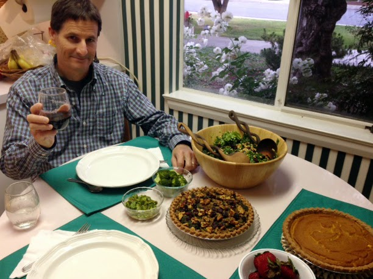

Judi made this tart from [Plant-Powered Kitchen](http://plantpoweredkitchen.com/recipe-page/?recipe_id=6033817) for Thanksgiving, and we loved it! It's delicious with cranberry sauce on it, but super delicious on its own, too. This is my a slightly adapted version. Note the pie crusts come in 2, so you could double, or make a [pumpkin pie](http://peachykeengreen.blogspot.com/2015/05/vegan-pumpkin-pie.html) with the other one! Serve with home-made cranberry sauce (recipe on the bag), [roasted veggies](http://peachykeengreen.blogspot.com/2015/04/roasted-vegetables.html), [mashed cauliflower potatoes](http://peachykeengreen.blogspot.com/2015/05/mashed-cauliflower-potatoes.html), and/or [kale salad](http://peachykeengreen.blogspot.com/2015/02/shredded-kale-salad-with-cranberry.html).

## Ingredients

- 1 T olive oil
- 1 cup onion, diced
- 1/2 C celery, diced
- 4-5 garlic cloves, minced
- 2 cups chickpeas, reserve 1/3 cup
- 2 T fresh squeezed lemon juice
- 1/2 tsp salt
- 1/2 tsp fresh ground black pepper
- 2 tsp tamari
- 3/4 cup walnuts, toasted
- 1/3 cup rolled oats
- 1 bag fresh chopped spinach (or kale)
- 1/4 cup dried cranberries (optionally soak them in a little water)
- 1 tsp thyme
- Pie crust: We like this [easy homemade whole wheat crust](http://peachykeengreen.blogspot.com/2016/11/vegan-pie-crust.html) or Whole Food's [Wholly Wholesome 9" Whole Wheat or Spelt Organic Pie Shell](http://www.whollywholesome.com/ourproducts-pie-shells.php)
- Topping
- 1/2 tsp olive oil
- 1 tsp tamari
- 2 T walnuts
- 1/4 cup dried cranberries (optionally, soak them in a little water)

## Instructions

Preheat oven to 400 degrees. Add oil to skillet, and cook onion, celery, and garlic over medium-high heat for 9-10 minutes, stirring occasionally, until softened and turning golden.

Transfer blended mixture to a food processor with chickpeas (except reserved 1/3 cup), lemon juice, tamari, salt, and pepper. Don't blend fully like hummus; leave some chunkier consistency. Add toasted walnuts and oats, and briefly pulse to lightly break up nuts.

In skillet, cook down spinach in a little oil. Turn off heat, and transfer food processor mixture to the skillet with the spinach. Stir in cranberries, thyme, and reserved chickpeas.

Transfer mixture to pie shell, smoothing to evenly distribute. Brush tamari/oil topping over top Sprinkle on walnuts and cranberries. Bake in preheated oven at 400 degrees for 30-35 minutes, until tart is golden on edges and top. Cool 5-10 minutes and serve.

Birthday-Boy Approved!
