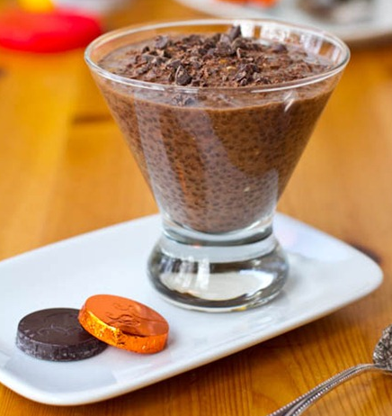
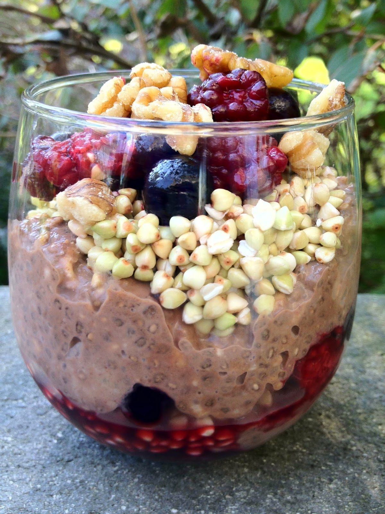

Happy Healthy and Oh She Glows both have recipes for chocolate chia pudding. One serving gives you all the omega 3's you need in a day! Happy Healthy has her [Overnight Chocolate Berry Breakfast Pudding](http://www.happyhealthylonglife.com/happy_healthy_long_life/2012/09/overnight-chocolate-berry-buckwheat-breakfast-groats-oats.html) for breakfast, and Oh She Glows dresses up her [Healthy Chocolate Chia Pudding](http://ohsheglows.com/2012/01/11/healthy-chocolate-chia-pudding/) for dessert with a little shaved chocolate (see photos below). They're similar, and I can verify that even the breakfast version works for dessert! You can omit the chocolate if you want a change; it's fine plain. You might also try using white chia seeds then, and maybe a bit more vanilla extract.

11/20/16 update: Oh my goodness. Stop the presses!

[Judi's Blended Chocolate Peanut Butter Chia Pudding](http://veryveryverygreen.blogspot.com/2016/10/blended-chocolate-peanut-butter-chia.html) is the best of them all. Dangerously good! I've modified the recipe below to add optional peanut butter and using a blender.

## Ingredients

- 2 cups almond (vanilla or plain) or coconut milk
- 1 T maple syrup
- 4-6 T chia seeds (use high end for dessert version)
- 1 T peanut butter (optional see Judi's recipe above)
- 1-2 T cocoa (less for breakfast, more for dessert)
- Breakfast version, add:
- 1 mashed banana
- 3/4 rolled oats (not instant)
- Toppings:
- Berries
- Walnuts (gives it great crunch)
- Buckwheat groats (optional)
- Shaved chocolate (for dessert version)

## Instructions

Two ways to do it:

1. If using peanut butter or want it to be more smooth, put everything in a food processor and mix.

2. Otherwise, heat 1/2 cup milk in the microwave for 40 seconds and dissolve cocoa in warmed milk. Mix all the (non-topping) ingredients together in a bowl.

Refrigerate 2-4 hours or overnight, in a big bowl (spoon out later), or separate serving glasses. Serve with toppings of your choice.

[Oh She Glows](http://ohsheglows.com/2012/01/11/healthy-chocolate-chia-pudding/)'s dessert version:

[Happy Healthy](http://www.happyhealthylonglife.com/happy_healthy_long_life/2012/09/overnight-chocolate-berry-buckwheat-breakfast-groats-oats.html)'s breakfast version:

