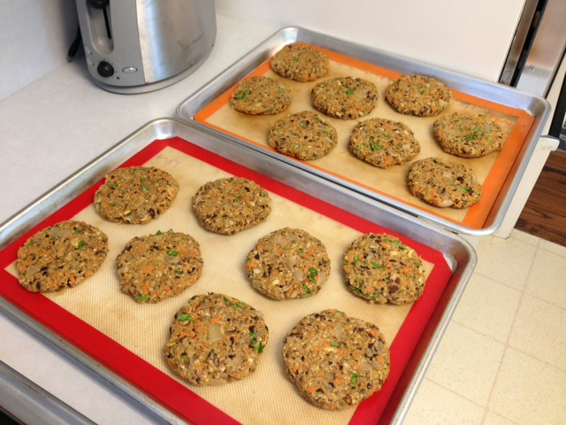
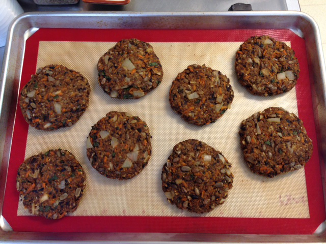

Our perfect veggie burger from [Oh She Glows](http://ohsheglows.com/2011/07/13/our-perfect-veggie-burger/). The nuts and seeds really make it, it's crispy outside, and it stays together well. I'm not a big parsley fan, so I use fresh basil instead of parsley, but otherwise I follow the recipe pretty much exactly. I usually make them for summer bbqs, so I prebake them 15 minutes and then we grill them a few minutes outside. Makes 8 burgers; sometimes I double it to have leftovers.

(
Image from [Oh She Glows](http://ohsheglows.com/2011/07/13/our-perfect-veggie-burger/))

## Ingredients

- 1/2 cup diced onion,
- 1 large garlic clove
- Flax eggs: 2.5 tbsp ground flax + 1/2 cup warm water, mixed in bowl
- 1 cup oats, processed into flour

1.5 cups bread crumbs

1 cup grated carrots

1 cup cooked black beans, rinsed and roughly mashed

1/4 cup finely chopped basil (or other herb)

1/3 cup toasted almonds, sliced or chopped

1/2 cup sunflower seeds

1 T olive pil

1 T soy sauce

1.5 tsp chili powder (heaping)

1 tsp cumin (heaping)

1 tsp oregano (heaping)

1/2 tsp salt (heaping)

ground pepper to taste
## Instructions

Preheat oven to 350F (if baking).

In a large skillet, sauté onions and garlic in 1/2 tbsp oil. Mix your flax egg together in a small bowl and set aside for at least 10 mins while you prepare the rest of the ingredients.

Place all ingredients (except spices and salt) into a large mixing bowl and stir very well. Add seasonings and salt to taste.

With slightly wet hands, shape dough into patties. Pack dough tightly as this will help it stick together.

You can fry the burgers in a bit of oil on a skillet over medium heat for about 5 minutes on each side. If baking in the oven, bake for 25-30 mins (15-17 minutes on each side) at 350F, until golden and crisp.

For the BBQ, pre-bake the burgers for about 15 minutes in oven before placing on a pre-heated grill until golden and crisp on each side.

A double batch, about to go in the oven:

Prebaked 15 minutes, ready for bbq:

