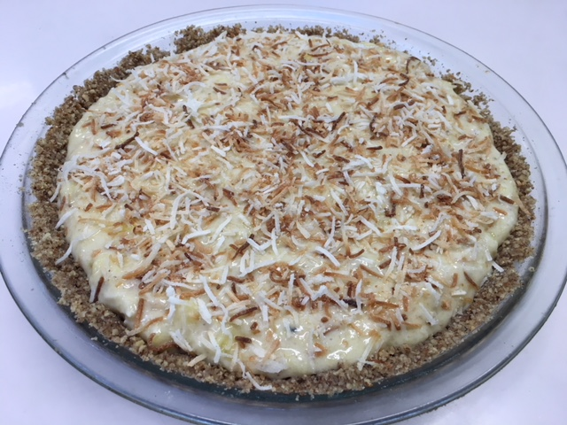
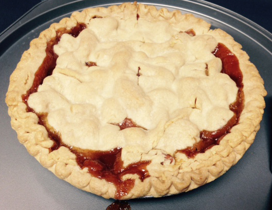
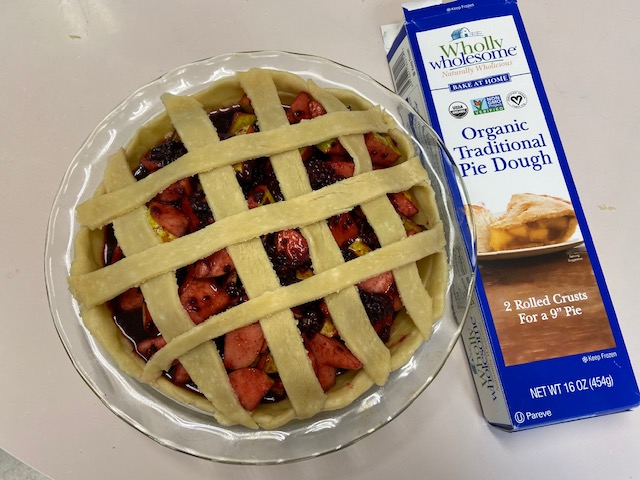
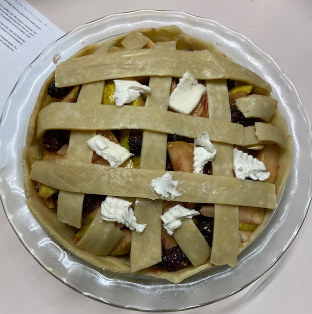
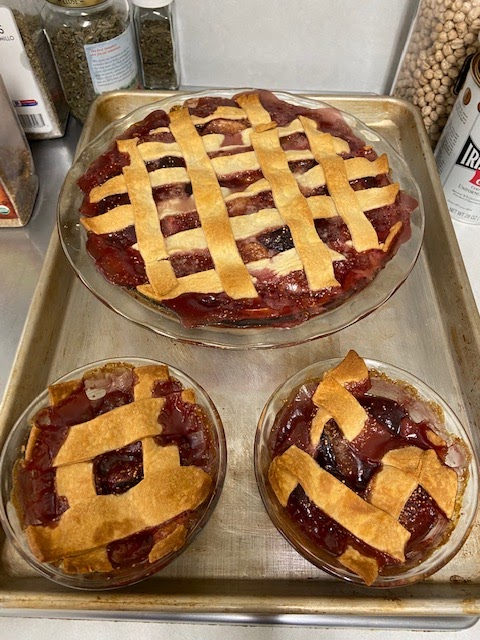

During a visit to Nebraska, Dad's friend Jack gave him a bag of about 30 fresh-picked peaches. I decided to try to make a pie, and after a little googling and experimenting, came up with an easy, yummy recipe. When our ripe pears and blackberries start entering the house in buckets, I can easily make a dozen pies. I freeze some blackberries and sliced-up pears so as to spread that out over time. Pears and strawberries are another great combination. That mix reminded me of [rhubarb pie](https://peachykeengreen.blogspot.com/2020/08/strawberry-rhubarb-pie.html), another great mix. And figs work, too!

## Ingredients

- 4-5 cups fruit, fresh or frozen:
- peaches, pears, apples, blackberries, strawberries, figs, or mix
- Dry:
- 2 T flour
- 2 T arrowroot or cornstarch
- 1/2 cup brown sugar
- 1 tsp cinnamon
- 1/2 tsp nutmeg (optional)
- Wet:
- 1 T lemon juice
- 1 tsp vanilla
- Dots of vegan butter
- 2 vegan pie crusts (like [Wholly Wholesome](http://www.whollywholesome.com/ourproducts-pie-shells.php)) or [make a vegan pie crust](https://peachykeengreen.blogspot.com/2016/11/vegan-pie-crust.html)

## Instructions

Arrange pie crust in pie pan and chill.

Cut up the fruit; no need to peel. Don't be shy, cut up a lot. It will cook down - or if you have too much, fill a couple of ramekins with the overflow! (See below).

Mix the dry ingredients in a medium bowl. Mix the lemon and vanilla in a small bowl and pour over fruit. Add mixed dry ingredients and stir just enough to mix.

Put filling in crust. Carefully top with second crust and make some x's in the top with a knife, or make a lattice -- my new favorite way. Lattice is pretty, uses less crust (marginally more healthy?), still tastes great, and leaves some to top extra ramekins. (Ramekin portions are fine without crust on the bottom, and a great way to use more from a bountiful harvest.)

Optionally dot with some vegan butter.

Bake at 375 for 50 min. Turn off oven and let sit to brown a little more, or take out if browned enough already.

Let cool. Serve plain or with vegan vanilla ice cream. We like vanilla Almond Dream or So Delicious Cashew Vanilla.

Here it is with pears and blackberries, and 2nd crust flipped on top:

And with Wholly Wholesome crust, trimmed to make criss-crosses on top, and butter dots:

And with extra-filled ramekins, with lattice on top. (Don't bother with crust on bottom of ramekins; it's still delish with crust only on top.) This is a fig pie!

