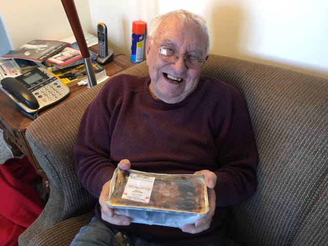
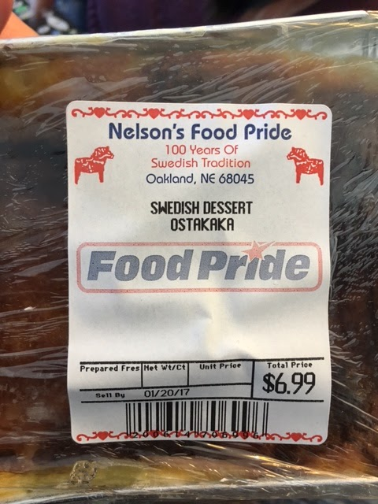

This is my grandma Esther's recipe for Ostakaka (Ost = cheese, kaka = cake), a custard from her Swedish family (*) and one of Dad's favorites. It's not vegan, but I'm blogging it for posterity (and I may try to make it for Dad some day.) [This recipe is similar](http://awesomecookery.com/2013/12/04/ostkake-swedish-cheesecake/). Another favorite dessert recipe is [grandma's lemon meringue pie](http://peachykeengreen.blogspot.com/2017/03/grandmas-lemon-meringue-pie.html).

1/6/17 Update: Cliff and Kathy gave us ostakaka from [Nelson Food Pride](http://www.nelsonsfoodpride.com/ostakaka1.html) during my trip to NE. (Nelson, like grandma!) Kathy makes it every Christmas, but it's an all day, error-prone affair, so they bought it this year. Just in time, phew! Dad loved it with jam. Not too sweet. And much easier than making it :)

12/29/20 Update: Lisa Nelson Callihan says there is a cheat way to make it!!!  Use cottage cheese instead of milk and rennet tablets. Use the 4% milkfat cottage cheese if you can find it.

## Ingredients

- 1 gallon whole milk, non-homogenized (may have to get it from a dairy)
- 2 T flour
- 1/8 t salt
- 1/2 C suger
- 3 eggs, beaten
- 1 cup cream
- 1 tsp vanilla
- rennet tablet (not old; may not work)
- cinnamon and nutmeg to sprinkle on top
- lingonberry or strawberry jam/preserves

## Instructions

Warm the milk in a big pot, just to lukewarm. Mix flour with 1/2 cup milk to make a thin paste. Add it to the warm milk, stirring well. Add dissolved rennet tablet, stirring well. Let set until clabbered [thickened or curdled, about 1 hour.] Stir it and take off the whey [the yellow, translucent liquid] as it comes to the top [or drain it off using a colander lined with cheesecloth]. Add beaten eggs, sugar, cream, salt, and vanilla. Bake 1 1/2 hours in 325 degree oven.

Cool. Sprinkle cinnamon and nutmeg on top. Serve with preserves.

(*) Larry and I visited Sweden in 2001, and in our travelogue we wrote: “Our lunchtime cafe's menu offers "oustakake", which turns out to be, literally, "cheesecake". Patti has an epiphany that her grandmother's custard "oustakake" was in fact a kind of cheesecake. The guides at Skansen said that the prestige item at a country smorgasbord (a potluck table of sandwiches and other food at a wedding or whatever) was that each Swedish family would bring their own particular type of cheesecake for the smorgasbord. Apparently Patti's family was the runny, custard-kind of family.” :)

