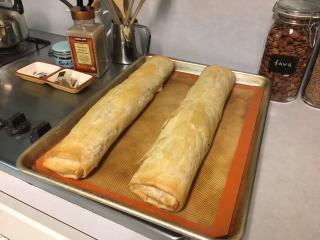

Larry brought in some cabbage and kale leaves from the garden, and I thought I'd try a new recipe. This is adapted from a mix of [Spinach & Mushroom Mini Vegan Puff Pastry Quiche](http://www.connoisseurusveg.com/spinach-mushroom-mini-vegan-puff-pastry-quiche/) and Oh She Glows [Stuffed Mushroom Phyllo Roll](http://ohsheglows.com/2011/08/23/stuffed-mushroom-phyllo-roll-mango-kale-salad/).

## Ingredients

- 1 sheet vegan puff pastry (about 8 oz.), thawed if frozen
- 1 cup shredded [Daiya cheese](http://daiyafoods.com/)
### Or Tofu Mix

- 1 lb. extra firm tofu, drained
- 1 T soy sauce
- 2 T lemon juice
- 2 T nutritional yeast
- black pepper to taste

### Saute

- 1 T olive oil
- 3 cups finely chopped mushrooms
- 1 onion, diced
- 2 garlic cloves, minced
- 4 cups finely chopped greens
- sundried tomatoes to taste (optional)

## Instructions

If not using Daiya cheese, use the tofu mix: Place tofu, soy sauce, lemon juice, nutritional yeast and pepper into food processor and blend until smooth.

Saute mushrooms and onion until softened, 5-10 minutes. Add garlic and greens. Remove from heat and fold in Daiya or tofu mixture.

Preheat oven to 350F. Line a large baking sheet with parchment paper or silicon liner. Thaw Phyllo dough according to package directions.

Place 1 sheet of Phyllo dough onto prepared baking sheet. Brush or spray on butter or oil. Repeat for 7 layers. Scoop on mushroom filling, [roll the edges inward as shown here](http://ohsheglows.com/2011/08/23/stuffed-mushroom-phyllo-roll-mango-kale-salad/), and then roll into a log. Brush log with oil or butter. Bake at 350F for 25-35 minutes until golden. Slice and enjoy!

Fresh out of the oven, before cutting:

