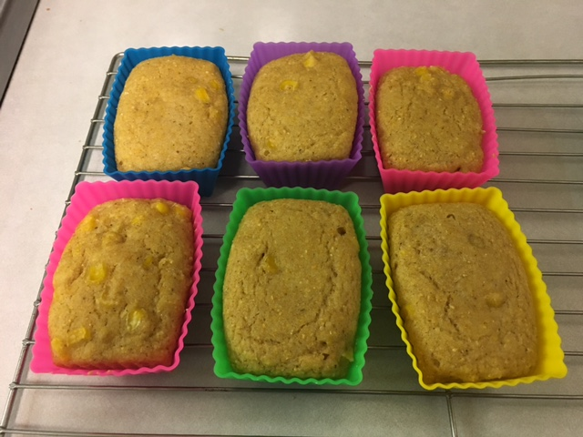

From [Isa Does It,](http://www.foodrepublic.com/recipes/vegan-cornbread-muffins-recipe/) with a few adaptations to replace the coconut oil and applesauce with coconut yogurt, and reduce the sugar a little (it's plenty sweet). And it's a good opportunity to use my new adorable teeny weeny [silicone baking cup](https://www.amazon.com/Pantry-Elements-Rectangular-Silicone-Baking/dp/B00ZYE43AA/)s. Makes about 12 teeny loaves (each about the size of a muffin).

Talking with Judi  later: she loves her [cornbread recipe](http://veryveryverygreen.blogspot.com/2013/11/cornbread.html) that has a 2 to 1 cornmeal to flour ratio and uses cashew cream and maple syrup. More cornmeal would be better; adjusted the recipe! Also updated based on [The Best Vegan Cornbread](https://www.noracooks.com/the-best-vegan-cornbread/) recipe that Rick and Lauren brought over (up'd the baking powder and sugar) and these[tips for good cornbread](https://rainbowplantlife.com/the-best-vegan-cornbread-youll-ever-eat/).

Note: There's a sliding scale between cornbread and corn cake. One bread end is represented by just 1/4 C sugar, which we like. Most folks are probably used to sweeter cornbread, though; if that's you, double it (as noted below, by adding agave--or just double the sugar).

## Ingredients

### Dry

- 3/4 C flour
- 1 1/4 C stone ground cornmeal
- 1 T baking powder
- 1 tsp salt
- 1/4 C brown sugar (for corn bread)
- (optional) 1/4 C agave (for corn cake :)
- (optional) 1 T chopped rosemary

### Wet

- 1 1/4 C non-dairy milk (almond or soy or oat)
- 2 tsp apple cider vinegar
- 4 T oil or vegan butter (or combo)
- (optional) 1 cup corn kernels (fresh or thawed)

## Instructions

Preheat oven to 350 degrees. In medium bowl, mix non-dairy milk and vinegar and set aside to curdle.

In a larger bowl, mix together the dry ingredients. Make a well in the center and add the curdled milk and oil/butter. Mix the wet and dry ingredients together just until the dry ingredients are moistened, being careful not to overmix. Fold in the corn, if using.

Let the batter sit for 10 minutes.

Butter a 9x9 pan with vegan butter and pour in batter. Or if using muffin tins, fill muffin most of the way full.

Bake for about 20 minutes. Yum!

Note that [these silicon loaves](https://www.amazon.com/Pantry-Elements-Rectangular-Silicone-Baking/dp/B00ZYE43AA/) are really tiny, like 2" x 3" -- about the size of a muffin. I thought they were bigger so I was bummed when they arrived, but now I think they are cute!

Yes, we ate half of them before I remembered to take a picture - quick!
