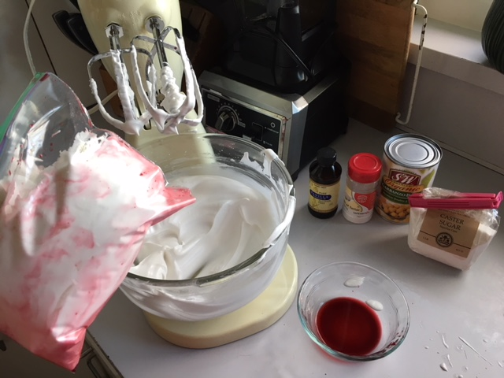
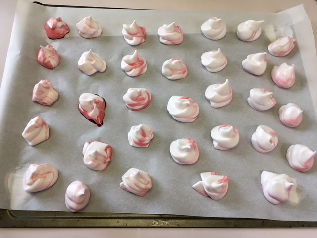
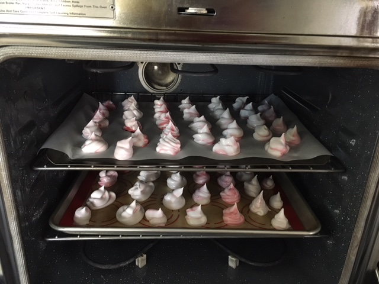

Wait, vegan meringue cookies? Aren't meringues made from whipped egg whites and sugar? Ya, that's right. And you won't believe what can be used in place of egg. Garbanzo bean liquid.

What? No, really, My pal Judi mentioned this months ago when she made [vegan macarons](http://www.crazyvegankitchen.com/raspberry-rose-vegan-macarons-using-aquafaba/). I pressure-cooked chickpeas last night (I love fresh hummus), and on a whim, saved the liquid in the fridge. Macarons are delicious, but a fair bit work, and I didn't have any coloring. Then I though of meringues (!) and found these [vegan meringue kisses](https://www.lazycatkitchen.com/vegan-meringue-kisses/) - and there are [many others](https://itdoesnttastelikechicken.com/vegan-meringue-cookies/). Crazy easy to make, but you need to be around for a couple hours because they cook on super low heat.

## Ingredients

- (makes about 60 meringues)
- 1 cup super fine (e.g., castor) sugar
- 1 cup liquid from cooked or canned chickpeas, chilled
- 1/2 tsp vanilla
- 1/4 tsp cream of tartar

### Optional

- 2 ziplock sandwich bags for squeezing (rather than dolloping)
- 4 tsp brightly colored juice, like beet (liquidy jam might work - very liquidy)

## Instructions

Pour the chilled liquid from the chickpeas into a glass mixer bowl. Start beating on high. After a few minutes, add the cream of tartar and vanilla. Continue whipping (you'll whip for about 10 minutes), using a spatula to scrape the sides periodically. When it gets thick, start adding the sugar, slowly (a tablespoon at a time). It should become nice and glossy. When it's thick enough that it doesn't slide if you tip the bowl, it's done!

Preheat oven to 210 degrees (yes, that low).

Put silicon (best) or parchment on a cookie sheet. (For me, the cookies stuck on parchment, but not on silicon.) Dollop on with a spoon, or use a Ziplock sandwich bag to make pretty kisses: Optionally put 2 tsp beet juice in the bag first, and swirl it around.  Fill the bag with half of the meringue, cut a corner, and squeeze meringues onto the sheet.

Bake for 1.5-2 hours (a long time, I know!) Turn off the oven, open the door, and let the cookies cool  for at least half an hour. Eat! Store leftovers in cool dry place to keep for a few days.

 Beet juice makes a great, healthy red dye!

Squeeze them out on parchment (or silicon)

Then in the oven at 210 for 1.5 hours!
