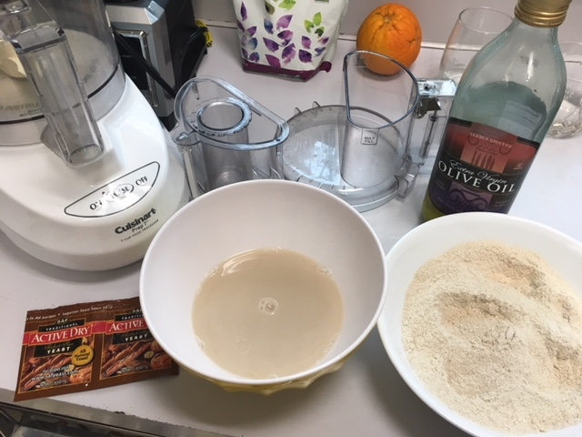
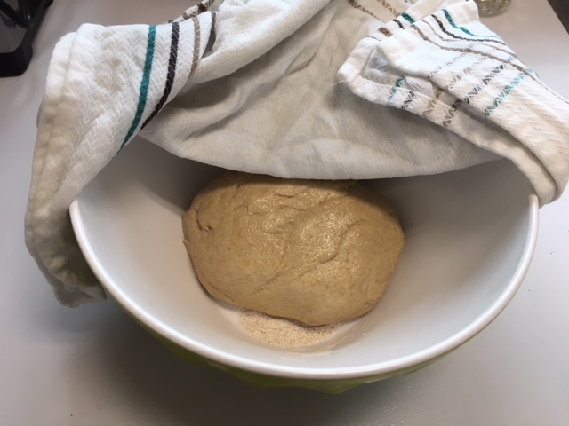
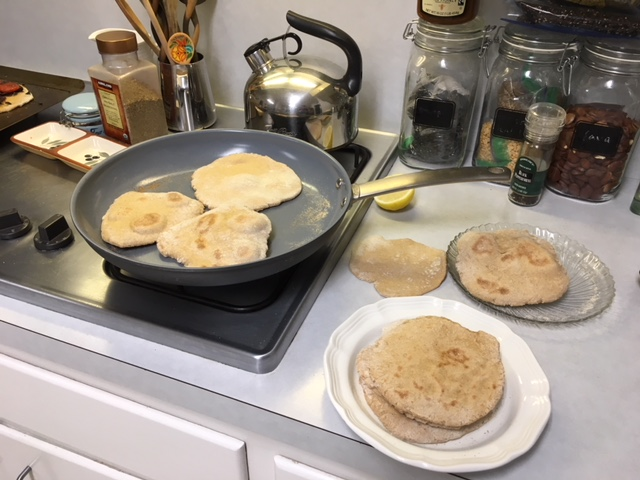
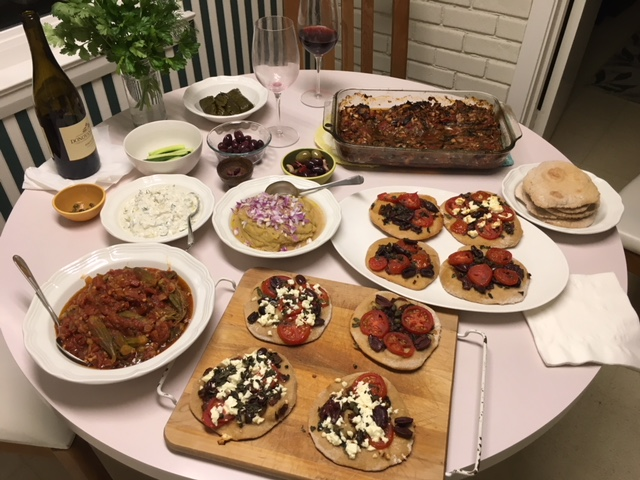
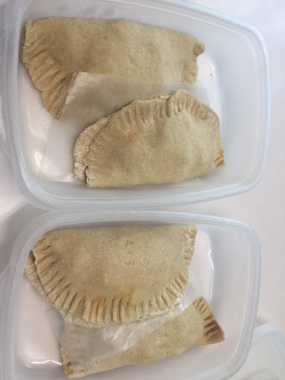

We like the Trader Joes Sprouted Whole-Grain Pizza Crust for this [homemade pizza](http://peachykeengreen.blogspot.com/2018/02/crispy-thin-pizza-pizza.html), but I wanted to make my own for a Greek meza (photos below) with Yannis, Merche, John, & Elsa. Mom made homemade bread all the time, but I've never made a yeast dough. Judi says it's easy; Nick makes dough for their pizzas all the time. Natalie did a science fair [experiment](http://thekcompanyblog.blogspot.com/2013/03/nats-experiment-for-science-fair.html) and found that adding sugar, honey, or maple syrup to the wet yeast made it rise more.  Judi says her favorite dough is whole wheat flour with a little maple syrup.

So that's what I tried here, while
mostly following the recipe for
[Roberta's Pizza Dough](https://cooking.nytimes.com/recipes/1016230-robertas-pizza-dough)
, which is surprisingly similar to this
[greek pita recipe](https://www.halfbakedharvest.com/traditional-greek-pita-bread/)
. We made
[pizza the greek way](https://www.williams-sonoma.com/recipe/pizza-with-caramelized-red-onions-olives-and-feta-cheese.html)
 with red onion, capers, oregano, and kalamata olives, and Yannis brought feta. We also had a meza of
[stewed okra](https://www.thespruce.com/stewed-greek-okra-1706417)
 in tomato sauce,
[greek fava](http://www.mygreekdish.com/recipe/authentic-greek-fava-recipe-yellow-split-peas-puree/)
 hummus, and
[stuffed eggplant](http://www.geniuskitchen.com/recipe/imam-bayildi-a-stuffed-eggplant-recipe-from-asia-minor-84776)
, which we ate with pita made from the dough. I used the leftovers to make empanadas with the leftovers (see photos below).

Our verdict: Worth it for pita and empanadas. For pizza, we'll probably stick with TJs. Next time we do a greek meza, we may skip the pizza and just have the meza with pita. The pizza was fun to make, but we had plenty of food without it, and the dough didn't shine in the pizza like it did in the pita.

## Ingredients

### Dry

- 2.5 cups whole wheat flour
- 1-2 tsp salt

### Wet

- 1 cup lukewarm water
- 1 packet yeast (~2 tsp)
- 1 tsp maple syrup
- 1 T olive oil

## Instructions
In a bowl, mix water, yeast, and maple syrup. Stir and let sit for 5 minutes.

Put dry the dry ingredients in the food processor and pulse briefly to combine. With the machine running, add the yeast mixture (from a container with a lip if you want to avoid spills). Unlike hand kneading that takes minutes, you "knead" the dough [briefly in the food processor](https://www.cooksillustrated.com/how_tos/5798-how-to-knead-bread-in-a-food-processor), like 45-90 seconds. Be careful not to over-knead. You want the dough to be a ball that springs back and is slightly sticky.

Take out the dough, separate into 2 equal pieces, and shape into balls. Brush the outside with a little olive oil and transfer to a bowl. Cover with dampened cloth and let it rise 3-4 hours on the counter or 8-24 hours in the fridge. If you refrigerate, remove it 30-45 minutes before you begin to shape it. It can stay in the refrigerator up to a week.

When you're ready to use the dough, gently deflate if needed, take out the amount you want to use, and turn it out onto a lightly floured surface.

For pizza, use the 2 equal pieces. For pita, split it into 8 equal pieces.

Gently flatten each ball into a thick disk. Using floured rolling pin, roll it out into the desired size, about a quarter inch thick. Turn the dough frequently and add flour as needed when rolling.

For pizza, just top and bake.

For pita, cook like you would pancakes, in medium-high heat pan. I have a special pancake pan that is ceramic that that I never oil, but you may have to put a little oil in your pan, or use a cast iron pan.

Place in pan, and **flip after 30 seconds or a minute, when you see bubbles starting to form. **Flip and cook 1-2 minutes on other side until large toasted spots form. **Flip again to toast other side. The pita should puff up. Remove, cool, and eat!

Photos, below.

 

After an hour, it doubled in size and I put it in the fridge, where it got a little bigger yet. Then that evening I took it out and made pita.

Frying pita!

The greek meza of pizza, stewed okra, baked eggplant, yellow split pea (fava) hummus, greek yogurt made by Yannis, dolma, capers ,and olives (purchased).

I made empanadas from the leftover dough: Rolled it out like a pita, filled with some of the leftover stewed okra and eggplant, flipped and pressed with a fork.

