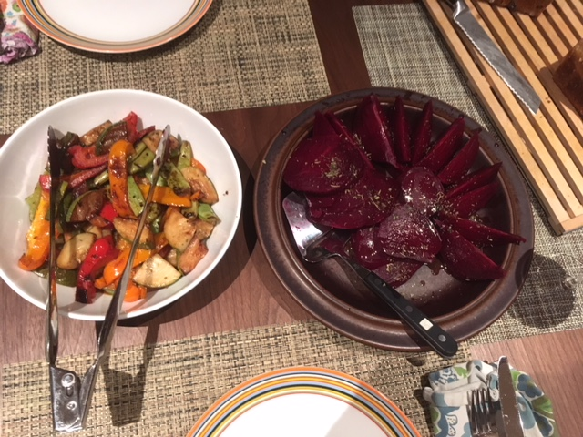

Dan Suthers is visiting! After a hike with Jeff, Jeremy invited us over for dinner, and allowed us to use his awesome kitchen to make Collaborative Couscous: a treasure hunt for ingredients that add color. Among the discoveries were figs, carrots, parsley, and green beans. Jeremy also grilled up fresh veggies from the local farmer's market, and prepared beets beforehand in the instant pot. Delicious!

## Ingredients

- 3 cups whole wheat couscous
- 3.5 cups vegetable broth (we used [Better than Bouillon](https://www.betterthanbouillon.com/products/organic-seasoned-vegetable-base/) vegetable base + water)
- 2 tsp olive oil
- 2 cups dry garbanzo beans (about a pound, pre-soak optional)
- whatever else you have on hand, for color; we had:
- 3 fresh figs, chopped
- 1 cup carrots, chopped
- 1/2 cup green beans chopped
### Seasoning (for Layers & Top)

- cumin
- garam masala
- salt & pepper
- fresh chopped parsley

## Instructions

Make garbanzo beans in the InstantPot: For dry beans, we used 40 minutes on manual setting (if pre-soaked for hours, 20 minutes would probably do).

While the beans are cooking, prepare other ingredients: cook any veggies (microwave, saute, or grill), chop the figs and parsley.

Bring the vegetable broth and oil to boil. Add couscous. Cover and set aside for at least 5-7 minutes.

Layer couscous, garbanzos, spices, other ingredients (we did 3 layers) in a large bowl (might want to save most for the top!) Served with sides of veggies and fresh bread and wine. Yum!

