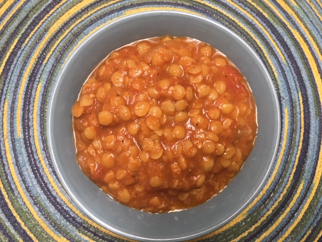

Dan Suthers shared his favorite dal recipe with me. Yay! For so long I've wanted a good dal recipe. How did he know? This dal is from [Vegan Richa's Indian Kitchen Cookbook](https://www.veganricha.com/vegan-richas-indian-kitchen-cookbook), which is now on my wish list. In the book it's called Masala Lentils or Sabut Masoor. Dan suggested doubling the recipe if you want a second meal, and since we always want a second meal, here's the recipe doubled. I made just a few other minor tweaks.

## Ingredients

1.5 cups lentils, brown or yellow, rinsed

4 cups water

1 cup finely chopped onion

1 T canola oil

4 T water

2 cans diced tomato (or 3 cups fresh)
### Spices

12 cloves garlic (I use TJ's jar of minced)

1 tsp cumin

4 tsp coriander

1 tsp cardamom (I ground seeds)

1 tsp cinnamon

1/4 tsp fenugreek seeds (if you have it)

2 tsp sweet or hot paprika (I had smoked)

1/4 tsp nutmeg

1/2 tsp pepper

2 T sriracha (or 3T if you like really hot)

1 tsp salt

4 T chopped cilantro (optional, garnish)

1 T vegan butter (optional, garnish)

## Instructions

Combine the lentils and water in a saucepan. Partially cover and cook over medium heat until the lentils are tender, about 25-30 minutes.

Heat the oil in a big soup pot and add onion. Cook until golden brown, 5-6 minutes.

Combine the spices and add to the soup pot. Add the 4 T water, and cook until fragrant, about 2 minutes. Stir in the tomatoes and salt, and cook until tomatoes are tender, about 8 minutes. (Note: the recipe suggests combining the spices in a blender; I didn't bother, because I couldn't see why you'd need to do that - it's mostly all powder!)

Add cooked lentils to the soup pot. Bring to boil over medium heat, reduce and simmer for another 10 minutes. Taste and adjust spicing. Optionally garnish with cilantro and vegan butter, if using. Serve warm, perhaps with rice. It was delicious!
