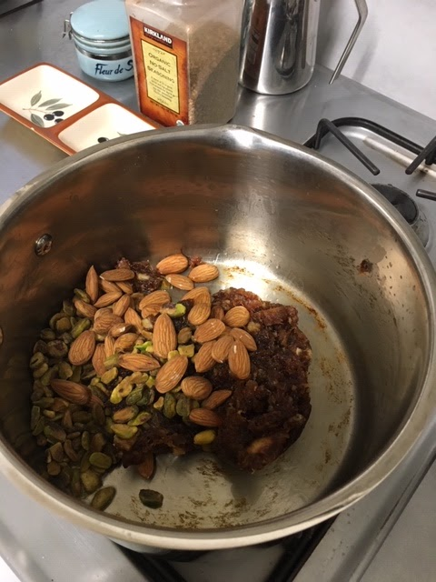
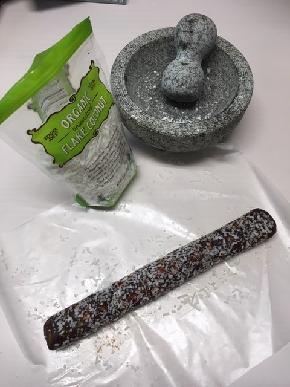
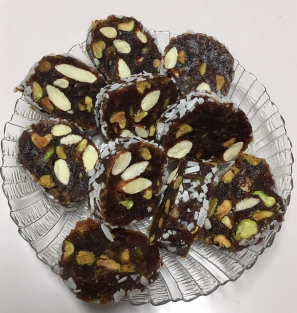

Omg, these date cookies are so good. Munira and her friend Shobha made them for a party we went to last night, and we got to take some home. The date, pistachio, cardamom, and coconut flavors are fantastic together. Here's how to make them!

## Ingredients

- 1/4 cup pistachios, whole
- 1/4 cup almonds, whole
- 2 T vegan butter
- 2 C medjool dates, chopped
- 2 tsp cardamom
- 4T finely shredded coconut (optional)

## Instructions

Chop dates (by hand or use food processor). Transfer to saucepan and cook over medium heat with vegan butter and cardamom. Saute for 5 minutes, stirring frequently. Reduce heat to low and stir until the mixture forms a paste (about 5 more minutes).

Add pistachios and almonds and combine well. Let the mixture cool to the touch.

Roll the mixture into a log (may want to roll between two sheets of parchment paper).

Roll the log in coconut flakes (I used a mortar & pestle to crush shredded coconut). Cover in plastic wrap and place in the fridge until firm (an hour or so).

Cut into slices and serve!

