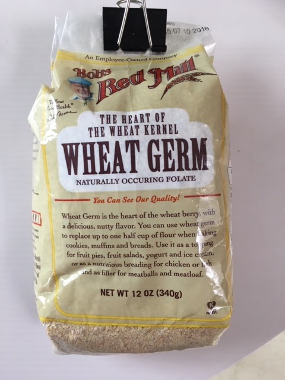

When we visited Chelsey and Josh last November, Chelsey made a delicious, super thick oatmeal. The secret? Almond milk and oats, almost equal amount! Then the other day, Jeff suggested adding wheat germ to oatmeal to get the maximal [autophagy benefits of spermadine](https://www.chalmers.se/en/areas-of-advance/lifescience/news/Pages/Spermidine.aspx), so that's a new addition. (See another nice summary of [spermidine and other anti-aging agents](http://www.resveratrolnews.com/live-young-wheat-germ/1246/).)

## Ingredients

- (per very hungry person)

1.5 cups almond milk (vanilla, sweetened ok)
1 heaping cup oatmeal flakes (NOT instant)

2 heaping T wheat germ

### Topping

blackberries or other berries

roasted flax seed

## Instructions

Mix the almond milk, oatmeal, and wheat germ in a saucepan and bring to a boil on the stove. Stir for a minute or two. Turn off heat, cover, set aside to thicken. When it's ready, dish out and top with berries and flax seed. Yum!

