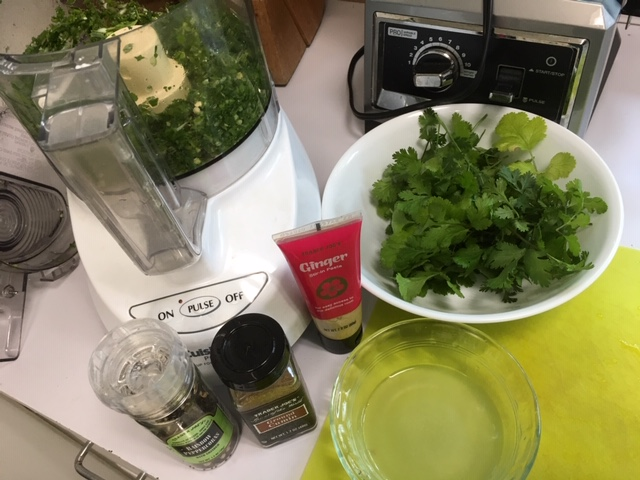
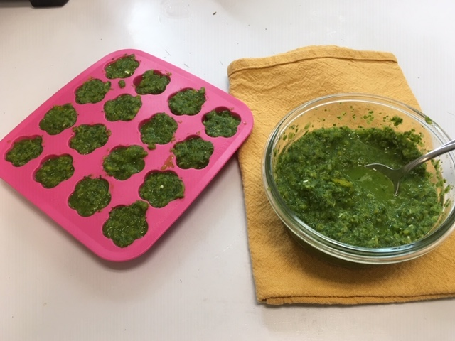

Munira gave us some delicious homemade hot green chutney. I tried to replicate it - with success: even Munira and Vinod liked it! This is adapted from a video Munira shared for this r[ecipe for Green Chutney (Mind & Coriander)](https://www.youtube.com/watch?v=Ef8IV-jmnRQ) and also Neelam Batra's The Indian Vegetarian cookbook. Most of the ingredients came from our garden, which was extra fun. Serve with samosas, on veggie burgers or sandwiches like [Pav Bhaji](http://peachykeengreen.blogspot.com/2019/05/pav-bhaji-and-muniras-secrets.html) (but that might make it too hot to eat!).

## Ingredients

- 1 red onion or 2 long scallions, sliced
- 2 jalapeno peppers, sliced (carefully!)
- 2 inches of ginger, sliced
- 2 C cilantro (fresh coriander)
- 1 C fresh mint
- (or 2 parts cilantro to 1 part mint)
- 1 tsp cumin
- juice from one lime (or lemon)
- optional:
- 1/4 cup seeds from pomegranate
- 2 cloves garlic
- 1 green or yellow pepper
- salt and pepper to taste

## Instructions

In the food processor, grind the onion, peppers, and ginger coarsely (and any optional ingredients like pomegranate and garlic, if using). Add the rest of the ingredients and blend. (Don't blend cilantro too long; it's nice to be a little course)

I like to freeze some in ice cube trays so I can grab some when I want it for a veggie burger.

