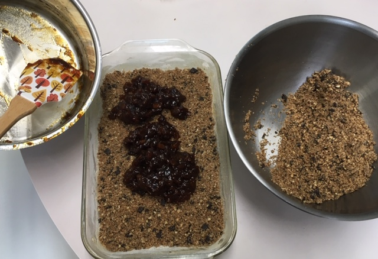
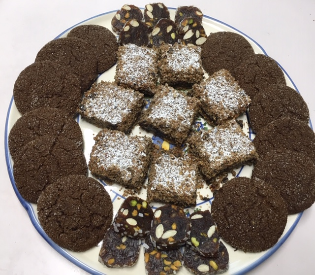

Wanda shared a chocolate chip apricot bar recipe
with me more than a decade ago, when I made it for our SRI chili cookoff and it won
best dessert! The recipe is adapted from a [Gourmet 1995](https://www.epicurious.com/recipes/food/views/chocolate-chip-apricot-bars-10136) recipe. I forgot about it until
yesterday, when I was thinking about what dessert to take to a neighbor's
barbecue. I mentioned to my dad that I thought I'd take cookies, and he said,
"Chocolate chip? Those would disappear!" He's right! But this is an
interesting twist on that -- with just a tweak to the butter to make it vegan, and reducing the brown sugar a bit (it's pretty sweet as is).

## Ingredients
### For Apricot Filling

- 6 oz dried apricots (~1 cup packed), chopped
- fine
- 1/4 cup granulated sugar
- 3/4 cup water
- 1 teaspoon vanilla

### For Chocolate Chip Mixture

- 1 1/3 cups pecans
- 1 cup all-purpose flour
- 1/2 cup firmly packed light brown sugar
- 1/2 teaspoon salt
- 1 cup semisweet chocolate chips
- 1/2 to 2/3 cup vegan butter (like [Miyokos](https://miyokos.com/) or Earth Balance)
- confectioners' sugar for sprinkling bars

## Instructions

Make apricot filling: In small saucepan
combine apricots, granulated sugar, and water, and simmer, covered, 15 minutes.
Remove lid and simmer mixture, stirring and mashing apricots, until excess liquid
is evaporated and filling is thickened. Stir in vanilla.

Preheat oven to 350 degrees. Grease and flour 11x7 or 8-inch-square baking pan.

Make chocolate chip mixture: In a shallow baking pan. toast
pecans in middle of oven until golden brown, 8 to 10 minutes. Let cool. In a
food processor, pulse pecans, flour, brown sugar, and salt until pecans are
coarsely chopped. Add chocolate chips and butter and pulse until pecan mixture
resembles coarse crumbs.

Press about half of chocolate chip mixture onto bottom of
prepared baking pan and spread evenly with apricot filling. Crumble remaining
chocolate chip mixture evenly over apricot filling, pressing it down slightly,
and bake confection in middle of oven 1 hour, or until golden. Cool confection
completely in pan on a rack. Sprinkle confection with confectioners' sugar and
cut into 16 bars.

Makes 16 bars

Cookie tray for neighbors party with Wanda's chocolate chip apricot bars bars, Elizabeth's [ginger molasses crinkles](http://peachykeengreen.blogspot.com/2019/05/ginger-molasses-cookies.html), and Munira's [date and nut cookies](http://peachykeengreen.blogspot.com/2019/01/muniras-date-and-nut-cookie-khajoor-ki.html). It was a hit!

