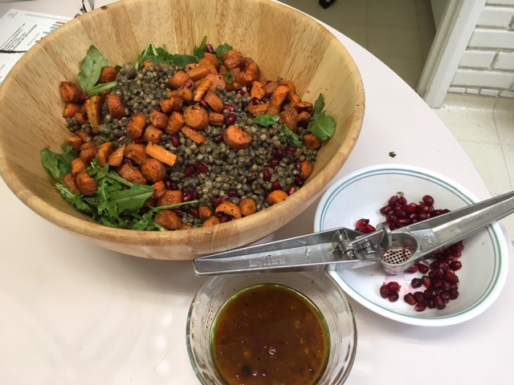

Shelley followed up the wonderful [mango guacamole](https://peachykeengreen.blogspot.com/2019/08/mango-guacamole.html) with a fresh pea soup and this fantastic [masala lentil salad](https://cookieandkate.com/masala-lentil-salad-with-cumin-roasted-carrots/), which is pretty easy to make if you buy the lentils & arugula ready to eat at trader Joes. Roast the carrots ahead of time and toss it all together!

## Ingredients

- 1 1/2 pounds carrots, sliced into 1/2-inch rounds
- 2 T olive oil
- 1 T maple syrup
- 1 1/2 tsp ground cumin
- 1 cup lentils (use precooked from Trader Joe's)
- 2 cups packed baby arugula
- Salt and freshly ground black pepper
- (optional) 1/3 cup chopped fresh mint leaves

### Masala Dressing

- 3 T extra-virgin olive oil
- 1 clove garlic, minced
- 1 tsp minced ginger
- 1 tsp garam masala
- 2 T apple cider vinegar
- 1/2 tsp salt
- Freshly ground black pepper
- (optional) Pomegranate molasses OR squeeze some juice out of pomegranate seeds
- (optional) Toasted pumpkin seeds, sunflower seeds, or pine nuts

## Instructions

Roast carrots: Preheat the oven to 400 degrees. Put the carrots in a large bowl. Drizzle with the oil and maple syrup, sprinkle with the cumin, and toss until evenly coated. Transfer to a lined baking sheet, spreading them in a single layer. Season generously with coarse salt and pepper. Bake for about 30 to 40 minutes, until the carrots are fork-tender and browning. Let cool.

Combine dressing ingredients in a small bowl and whisk until evenly combined. I don't have pomegranate molasses around, so we used a garlic press to get some juice out of some pomegranate seeds and added that (a couple of tablespoons I think) to the dressing.

Toss together all the salad ingredients.

Pour the dressing over the salad and toss gently until evenly combined.

