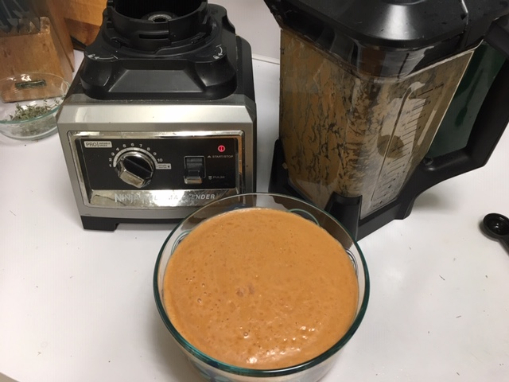

Last month we went for a walk on the beach near Half Moon Bay, where Larry proposed 22 years ago. Along the way, we came across a small tapas place and had some *delicious* gazpacho. Googling for a good recipe, I came across this [Best Gazpacho](https://cooking.nytimes.com/recipes/1017577-best-gazpacho) in the New York Times that looks just like what we had. I tried this with a regular green pepper, sherry vinegar, some scallions and tomatoes from our garden, and cucumber from our neighbor Elsa's garden. We used our Ninja blender, didn't strain it, and only chilled 15 minutes. It was delish!

## Ingredients

- 2 pounds ripe red tomatoes
- 1 long, light green pepper (e.g., cubanelle) if you can get it - or a regular green bell pepper is ok
- 1 cucumber, about 8 inches long, partly peeled
- 1 small mild onion (white or red)
- 2 cloves garlic
- 1 tsp salt (some may want more)
- 1/2 tsp cumin (optional!)
- 2 tsp sherry vinegar (or substitute with a sweet white, apple, or rice wine vinegar)
- 1/3 C extra-virgin olive oil

## Instructions

Cut tomatoes, pepper, cucumber, and onion into rough chunks. Combine tomatoes, pepper, cucumber, onion and garlic in food processor or blender (we have a Ninja blender and that's perfect!) Blend at high speed until very smooth, at least 2 minutes, scraping sides.

With the motor running, add the vinegar and salt. Slowly drizzle in the olive oil. The mixture will turn bright orange or dark pink and become smooth and emulsified, like a salad dressing. If it still seems watery, drizzle in more olive oil until texture is creamy.

(Optional) Strain the mixture through a sieve pushing all the liquid through with a spatula, and discard the solids. We didn't do this because the Ninja blender pureed it well, and we like fiber :)

"Transfer to a bowl and chill at least 6 hours or overnight." HAHAHAHA. That's what the original recipe says. We couldn't wait - chilled 15 minutes and ate it. It was delicious!

The original also says: "Before serving, adjust the seasonings with salt and vinegar. If soup is very thick, stir in a few tablespoons ice water. A few drops of olive oil on top is a nice touch." That would be a good thing to try with the leftovers. We ate it too quickly this time.

Fresh out of the blender - filled to the top with cut up veggies, about 2/3 full after emulsifying.

20th wedding anniversary -- whooooosh!
