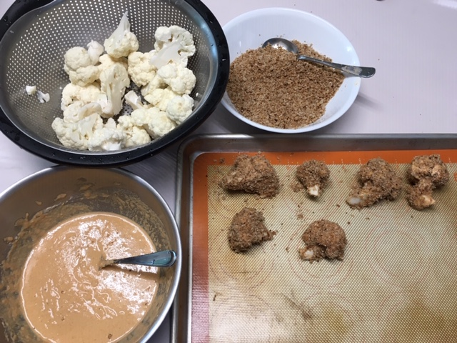
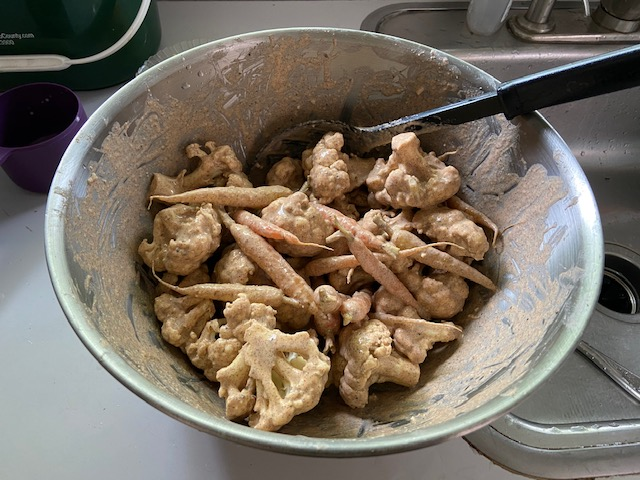
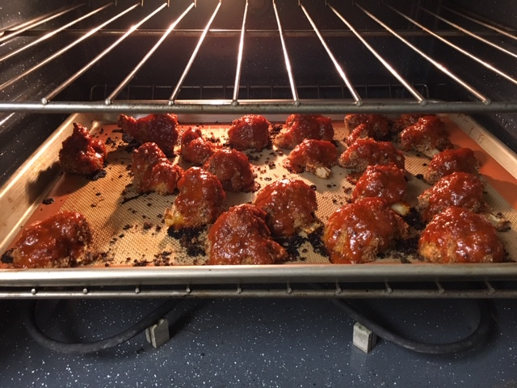

We've had some really good buffalo cauliflower at [Vegenation](https://vegenationlv.com/) in Las Vegas, and I finally got around to trying to make it. It was tasty! Here's what a did - which is a combination of a recipe in [Vegan Comfort Classics](https://www.amazon.com/Hot-Food-Vegan-Comfort-Classics-ebook/dp/B071PCM3Q3) and some recipes I found on the web, like [this one that has a nice video](https://tasty.co/recipe/buffalo-cauliflower). Yum!

## Ingredients

- 1 large (or 2 small) head cauliflower
- 2 cups bread crumbs
- 1/2 cup wheat germ (optional)

### Batter

- 3/4 cup flour
- 2 tsp garlic powder
- 2 tsp onion powder (optional)
- 1 tsp cumin
- 1 tsp paprika
- 1/2 tsp each salt & pepper
- 1 1/3 cup nondairy milk

### Buffalo Sauce

- 2 T vegan butter
- 1/4 cup Sriracha (or more; 1/3 ?)
- 1/4 cup ketchup
- 1 T maple syrup

### Ranch Dressing

- 1/2 cup vegan mayo
- 2 tsp apple cider
- 1 T chopped fresh dill or 2 tsp dried
- 1 T chopped chives
- 1 tsp onion powder (optional)
- 1/4 cup nondairy milk (optional; if you like it a little thinner; I do)
- salt and pepper to taste
- chopped chives for topping (optional)

## Instructions

Clean and cut up the cauliflower. Mix together the batter ingredients - and you can add more or less nondairy milk depending on how thick you want it. I like the batter thinner, so I use almost twice the amount of milk as flour.

Make bread crumbs if needed (I make mine by toasting 3 pieces of whole wheat bread and processing them into crumbs in the food processor. I also like adding in wheat germ for [autophagy](https://www.tandfonline.com/doi/full/10.1080/15548627.2018.1530929) / [longevit](https://www.scientificamerican.com/article/common-nutrient-keeps-fli/)y reasons).

Dip the cauliflower in the batter one at a time, or just [pour the cauliflower in the bowl](https://tasty.co/recipe/buffalo-cauliflower)and mix it up! Then coat the battered cauliflower with breadcrumb/wheat germ mixture. I did it one-by-one, picking up and spooning bread crumbs over each. Some recipes skip the breadcrumbs, but Comfort Classics says it's important - and it was tasty and worth the extra step, I think.

Place on a silicon-lined cookie sheet and bake at 425 degrees for 15 minutes.

At this point, you can either mix up the buffalo sauce (below), or take the cauliflower out after 15 minutes, let cool, freeze it, and come back another day and take it out to finish -- you could do this to make it faster to make for a get-together, for example (a Vegenation waiter mentioned that theirs is battered and frozen, and then brought out for the final cooking step when ordered).

Buffalo sauce: Mix sauce ingredients in a small saucepan. Brush or spoon the sauce over cauliflower and then put it in the oven for 10 more minutes. While you wait, mix up the ranch dressing.

Take it out of the oven right away; the bites are better a bit firm than a bit mushy/overdone!

Take out and serve. Oh, topping it with chopped chives looks good, too! Yuuuum.

And some photos of the process:

Can just throw it all in a big bowl of batter! Here with carrots :)

Yea, there are some open spots in the pan in the oven... some baked cauliflower mysteriously disappeared before it went back into the oven.
