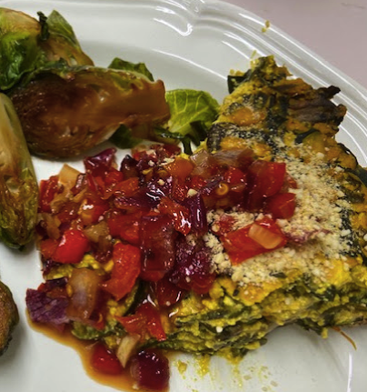
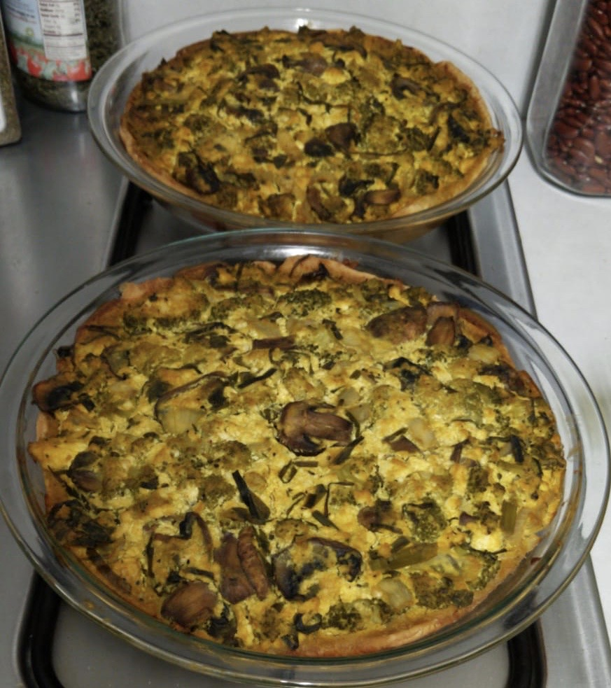

Our neighbor Elsa gave us 4 beautiful fresh leeks from her garden. I had been planning to make my [chickpea tart](https://peachykeengreen.blogspot.com/2015/05/festive-chickpea-tart.html), but then I found a mushroom leek quiche in [Vegan Comfort Classics](https://www.amazon.com/dp/B071PCM3Q3/) that looked worth a try! Here's my slightly adapted version, using zucchinis and mushroom. The red pepper relish is amazing on crackers or anything else you might serve a chutney with.  If you don't have time to make the relish, cranberry sauce or mango chutney is pretty good with the quiche. The Parm is totally optional; I've made this several times and don't usually bother with it anymore.

## Ingredients

- 2 pie crusts; like Wholly Wholesome or  [whole wheat pie crust](https://peachykeengreen.blogspot.com/2016/11/vegan-pie-crust.html)
- Veggie saute:
- 2 T canola oil
- 2 C leeks or onion, diced
- 1-2 C mushrooms, sliced
- 2 C zucchini or broccoli, chopped
- 1 tomato or red pepper, chopped (optional)
- 3 cloves garlic, minced
- 1/2 tsp salt
- 1/2 tsp pepper
- optional:
- 1 tsp sage (or 1T fresh)
- 1 tsp tarragon
- 1 carton [Egg from Plants](https://www.ju.st/eat/eggs) (16 oz)
- 2 slices vegan cheese, chopped (optional)
- OR
- Tofu mix:
- 2 12-oz silken tofu
- 1/4 C nutritional yeast
- 1/3 C chickpea flour
- 1 T white vinegar
- 1 T lemon juice
- 1 T arrowroot or cornstarch
- 1 tsp mustard
- 1 tsp turmeric
- 1/2 tsp smoked paprika
- 1 C vegetable broth
- Red pepper relish:
- 2 T canola oil
- 1 C red onion, chopped
- 1 red pepper, chopped
- 5 cloves garlic, minced
- 1/2 tsp salt
- 1/2 tsp red pepper flakes
- 1 tsp mustard
- 1/3 C suger
- 1/3 C white vinegar
- The Parm (optional)
- 1/3 C raw cashew
- 2 T nutritional yeast
- 1/2 tsp salt

## Instructions

Pre-bake pie crust for 10 minutes in 425 degree oven. Let cool.

(Optional) Make The Parm: Combine cashews, nutritional yeast, and salt in a food processor until fine crumb is formed.

Saute onion with salt in oil for 3 minutes. Add veggies and saute another couple minutes. Add garlic, pepper, and any other spices. Stir and cook another 2 minutes.

If using "Egg from Plants", put veggies in pie crust and pour over. Optionally dot the top with pieces of vegan cheese, and put in oven. The red pepper relish is delish, but not needed for this Just Egg version.

If using tofu: Drain tofu and put in a food processor with remaining ingredients (or hand mix/mash well). Fold tofu mix and broth into sauteed vegetables and combine. Spread filling into pie crust. If using leeks, can put some more on top, and optionally sprinkle on 2 T of The Parm. Bake at 350 degrees for 40 minutes.

Make the red pepper relish: Saute the pepper and onion 5 minutes in oil. Add garlic, red pepper flakes, salt, and mustard, and saute another 3 minutes. Add sugar and vinegar, bring to a simmer, and cook for 10 minutes until most of the liquid is absorbed. Let cool & serve with quiche!

With red pepper relish:

Tofu version:

