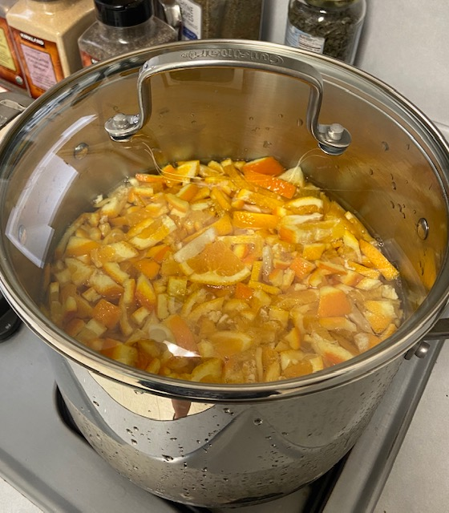
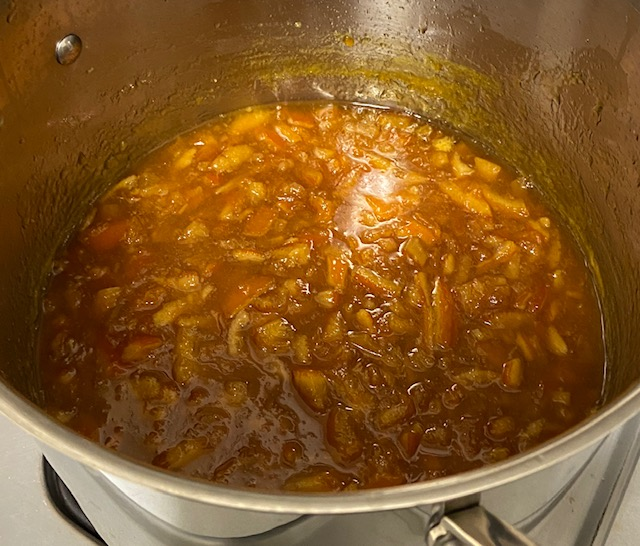
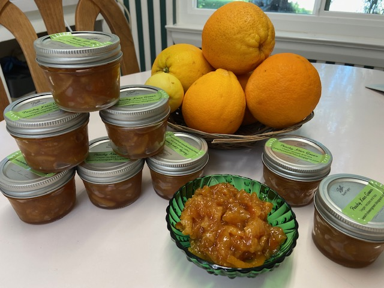

Every year we have so many oranges! They're more difficult to give away this year given COVID... we give to a few neighbors and friends, but I can't take them to the office and hand them out like in past years. An abundance of pears lead to [ginger pear sauce](https://peachykeengreen.blogspot.com/2015/02/caramelized-ginger-pears.html) and too many fingers led to [candied buddha's hands](https://peachykeengreen.blogspot.com/2020/01/candied-buddhas-hand-citron.html)... so doh, why not try my hand at marmalade? After skimming several recipes on the web, I decided to adapt this [orange lemon marmalade recipe](https://www.culinaryhill.com/orange-marmalade-recipe/) slightly to use less sugar and more oranges. It's just a little tart, and really delicious! The neighbors loved it. One request from Kurt & Pete: Cut the rinds into even smaller pieces.

## Ingredients

- 5-6 oranges
- rinds from another 2-3 oranges
- rinds from 2 lemons
- 1 lime (all of it if it's small, or just rinds)
- 8 C water
- 6 C sugar
## Instructions

Wash the oranges and lemons well and cut off any bad parts. Thinly slice and throw in a big pot. Eat a few oranges after you cut off the ends because they are so delicious. Realize you've eaten 3 oranges already and go find 3 more to replace what you ate. Toss in the chopped rinds from the oranges you ate, resulting in a rind-heavy marmalade (which, I learned later from my brother, is the secret to good marmalade -- yay serendipity.)

Place the pot of sliced fruit on the stove. Add the water and bring to a boil. Remove from heat and add the sugar and stir until it dissolves. Turn off the heat and forget about it for 6-8 hours or overnight, until the pot is room temperature.

Bring the mixture back to a boil, reduce heat, and simmer uncovered for 2 hours. Turn up heat to medium and boil gently, stirring often, for another 30 minutes. Put in a candy thermometer and cook until reaches (or gets close to) 220 degrees so the natural pectin gels with the sugar. Stir often and watch the thermometer closely - don't want to burn it! (And if it doesn't reach 220 but gets close, that's good enough - don't cook over like 3 hours. Once I simmered for 4 hours, and that was too much. It got too thick; it's okay for it to flow!) Turn off heat and let cool.

Spoon the marmalade into clean jars, wipe rims and seal. Chill in refrigerator. It may take a day or two for the natural pectin to set up properly. If refrigerating, use within a month (give it away to your friends and neighbors!), or freeze for 3 months.

