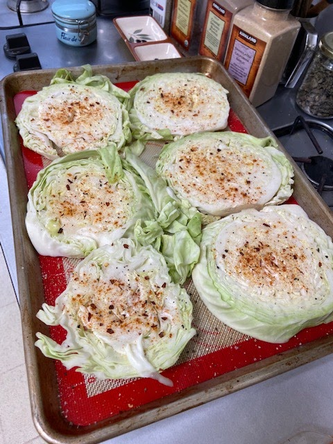
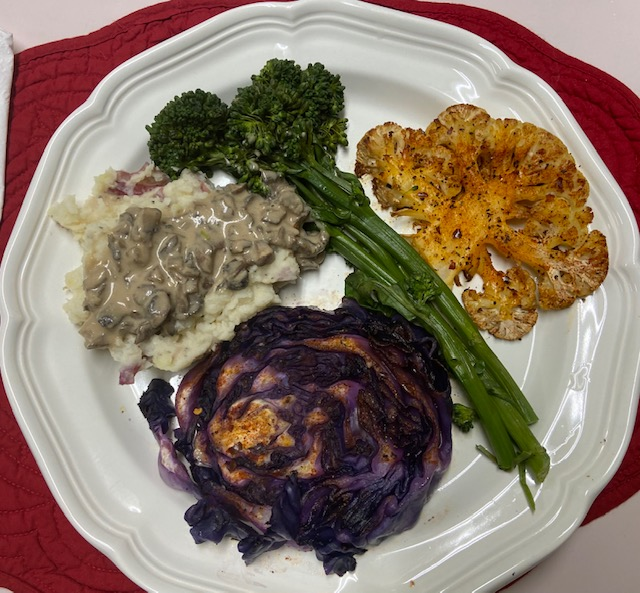
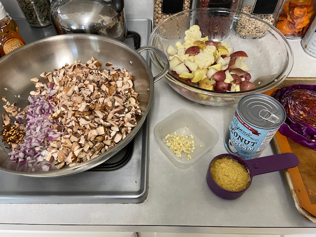
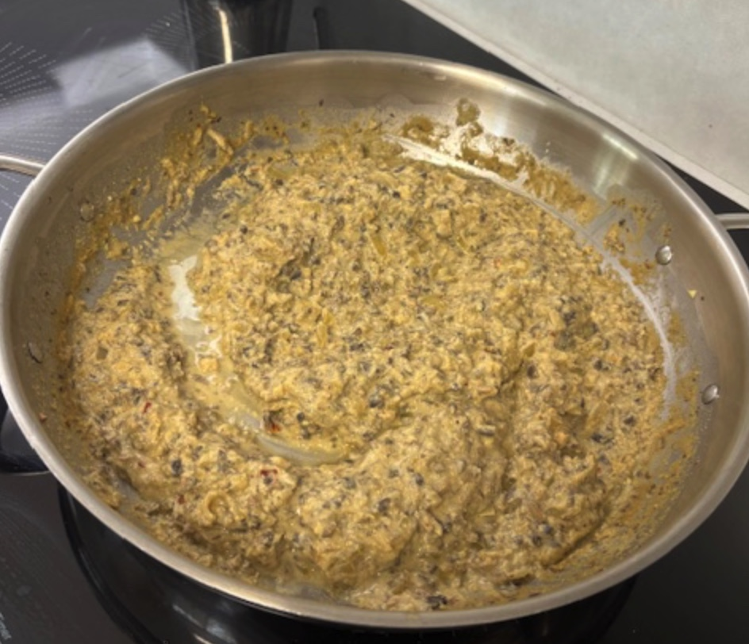
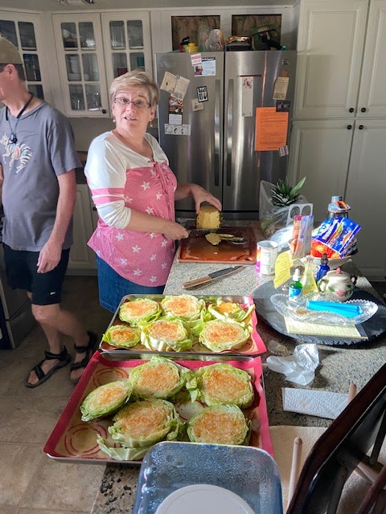
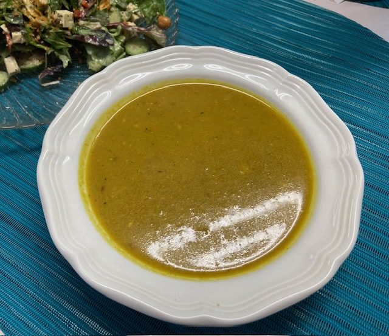

Laurie tried out some new recipes for dinner when we stopped by on our way back from our Nebraska road trip -- and it was delicious! Who'da thought that cabbage could make such a good steak? The
 gravy (finely chopped mushrooms, cashew cream, nutritional yeast) is a perfect, rich complement to the potatoes and cabbage. Laurie used green cabbage; I've tried green and purple, and also cauliflower. All yum! The mushroom gravy ties it all together.

## Ingredients

- 1 cabbage, green or purple
- Canola oil for brushing
- garlic powder
- red pepper flakes
- black pepper to taste
- salt to taste
- lemon juice (to squeeze on top after)
### Gravy

- mushrooms, 8-10 oz
- 1/2 onion, chopped
- 2 T canola oil
- 3 cloves garlic, minced
- red pepper flakes
- salt & pepper to taste
- 1/2 C nutritional yeast

### Cashew Cream (make in Blender)

- 1/2 C cashews
- 2/3 C water
- 2 T olive oil
- 1 T lemon juice
- 1 garlic clove
- 1/2 tsp salt

## Instructions

Make [mashed (cauliflower) potatoes](https://peachykeengreen.blogspot.com/2015/05/mashed-cauliflower-potatoes.html) before, during, or after the following :)

Cabbage steaks: Slide the cabbage into 3/4 inch thick steaks. Brush them with oil, and sprinkle garlic, paprika, pepper flakes, salt & pepper on both sides, to taste. Arrange on cookie sheet (see below) and roast in the oven on 350 degrees for 50 minutes. Remove and squeeze some lemon on top before serving.

Mushroom gravy: Finely chop the mushrooms (and onion, if using), and saute in oil with garlic, salt, and pepper. Turn down the heat, add the cashew cream and nutritional yeast, and cook another half hour. Serve over [mashed cauliflower potatoes](https://peachykeengreen.blogspot.com/2015/05/mashed-cauliflower-potatoes.html)!
Also good w/ purple cabbage (cauliflower steak, too)

Laurie's inspiration:

