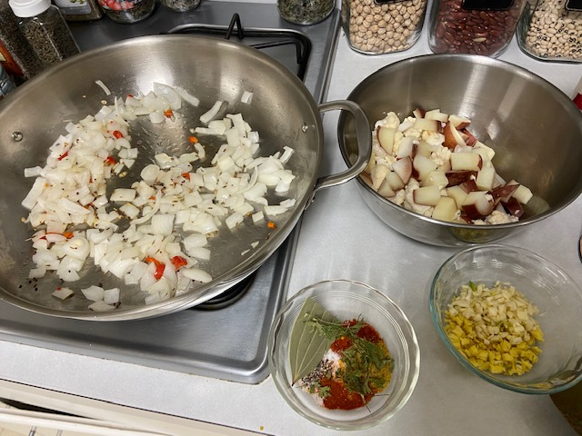

Larry asked his colleague Supraja what she had for lunch the other day, and she shared this [cauliflower curry](https://www.foodfidelity.com/cauliflower-curry/) recipe. I had a small head of cauliflower and some potatoes and cabbage to use, so I added a few more vegetables and changed up the spicing a little (making up the "curry" part with the various spices I have), and it was very good! Thank you, Supraja!

## Ingredients

- 1 small cauliflower, chopped
- 2 medium potatoes, chopped
- 2 C cabbage, chopped
- 1 onion, chopped
- 2 T canola oil
- 1 hot pepper, minced
- 2 tsp cumin seed
- 1 tsp mustard seed
- 1/2 tsp fenugreek seed
- 4 cloves garlic, minced
- 1" ginger, minced

### Spices

- 1 bay leaf
- 1 tsp thyme
- 2 tsp turmeric
- 2 tsp coriander
- 2 tsp chili pwd
- 1/2 tsp paprika
- 1 tsp salt
- 1 tsp black pepper
- 2 T dried or fresh cilantro
- 1 can diced tomatoes
- 1 can coconut milk
- zest of 1 lime

## Instructions

Chop the vegetables. Steam the potatoes and cauliflower in the microwave for 4 minutes to precook them a little, and set aside to cool. Mix the spices and set aside.

Saute onion, hot pepper, and seeds (cumin, mustard, fenugreek) in oil for a few minutes until the onion turns a bit translucent. Add garlic and ginger and saute another minute. Add cabbage and saute a couple more minutes. Add spices and saute a minute. Add tomato and cook a few minutes to reduce the juices. Add coconut milk and stir; then add cauliflower and potato and stir.

Let it all simmer, covered, for 15-20 minutes, stirring occasionally, until preferred tenderness.

Grate lime zest on top to finish the dish. Serve over rice with fresh cilantro and some lime juice.

