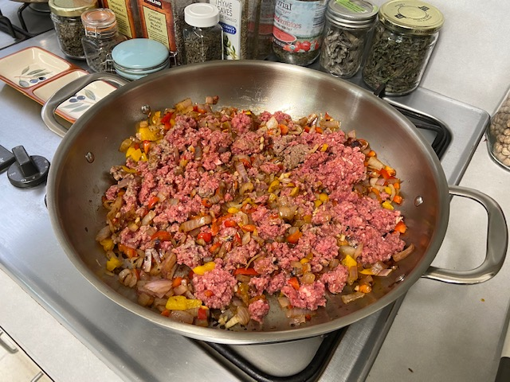
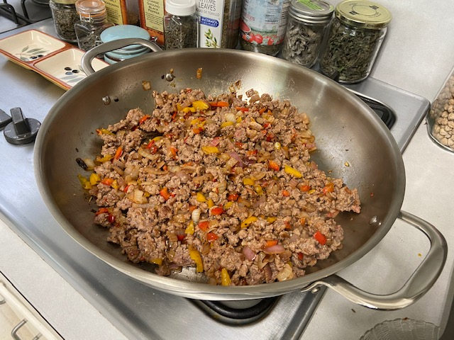
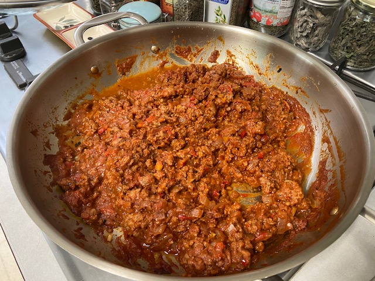

In honor of our new President-elect -- and his fine VP-elect -- I decided to try to make sloppy joes from the (new) [Impossible Burger](https://impossiblefoods.com/) plant-based meat I got at Trader Joe's last week. What follows is a mashup of 4 different recipes, plus a little twist of heat. It was delicious! You could *totally* fool carnivores with this one. ("What, this is all plants?  [C'mon, man](https://www.redbubble.com/i/sticker/C-Mon-Man-Joe-Biden-by-CarterCooper/41365791.EJUG5)!")

## Ingredients

- 1 package Impossible burger beef
- 2 T canola oil
- 1 onion, chopped
- 1 tsp cumin seed
- 1/2 tsp pepper flakes
- 1 bell pepper, chopped
- 2 cloves garlic, minced

### Sauce (or Could Use Bbq Sauce)

- 15 oz can tomato sauce
- 1 T brown sugar or molasses
- 2 T yellow mustard
- 2 T ketchup (or tomato paste)
- 1 tsp chili pwd
- 1 tsp smoked paprika
- 1/4 tsp salt
- 1/4 tsp pepper

## Instructions

Sauté cumin seed, pepper flakes, and onion in oil for 2-3 minutes. While it's cooking, whisk together sauce.

Add garlic and bell pepper and cook 2-3 more minutes, until onion is translucent.

Add beef and cook until browned.

Add sauce! Cover and cook for 15-20 min.

Serve on toasted bun with pickles and/or chopped onion (optional).

Cooking: Crazy how much it looks like hamburger:

And browns like hamburger:

