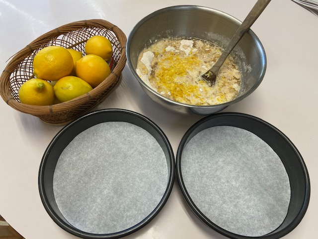
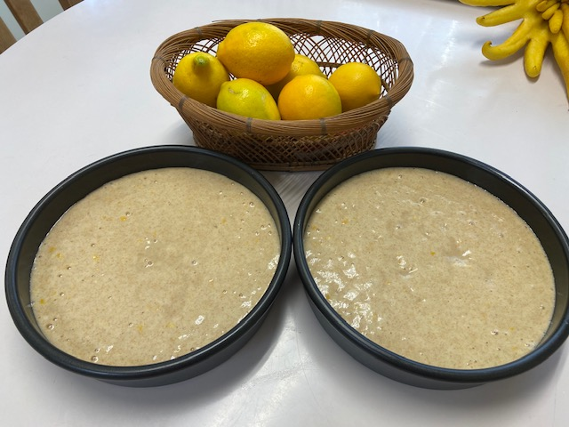
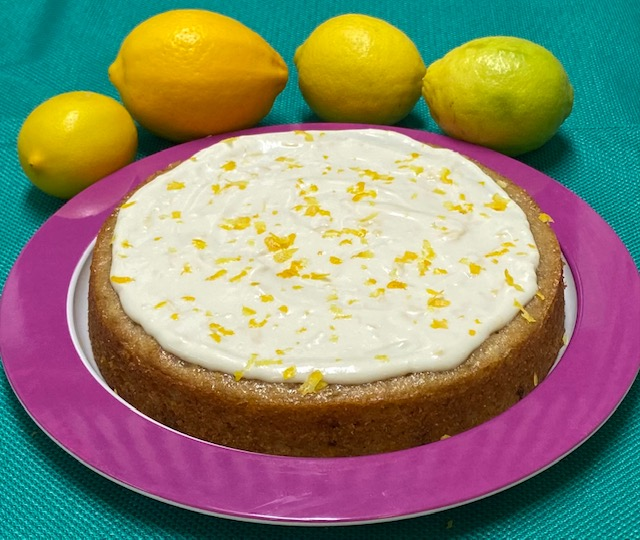
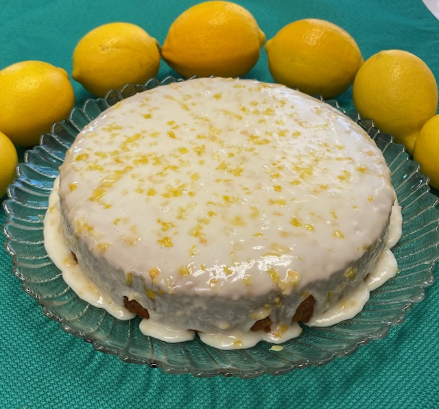
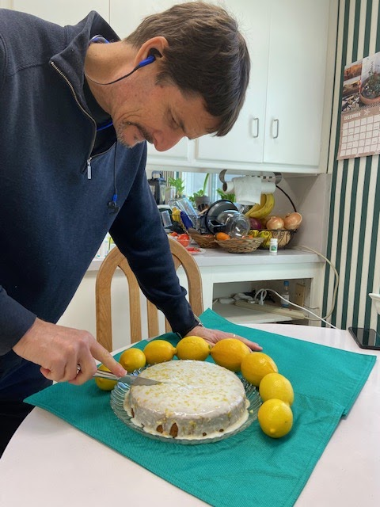

It's lemon season! When the frost comes they go bad, so Larry is bringing in scores of meyer lemons and limes. After success with [key lime yogurt](https://peachykeengreen.blogspot.com/2019/05/soy-yogurt-with-instant-pot.html), I got a craving for lemon cake. Larry said yes, please! (And Sandy says lemon cake is one of her favorites - good to know!) I tried this [loving it vegan recipe](https://lovingitvegan.com/vegan-lemon-cake/), and the cake was delish. The powdered-sugar frosting was sweeter than we liked, though. Then I tried a vegan cream cheese frosting from [Vegan Richa](https://www.veganricha.com/vegan-lemon-cake-with-cream-cheese-frosting/), which was pretty good.

It's yummy without any frosting, just as a lemon bread -- which is probably how I'll use this recipe in the future

## Ingredients
### Dry

- 1 C + 1 T whole-wheat flour
- 1 1/2 C white flour
- 1 1/2 C sugar
- 1 1/2 tsp. baking soda
- 1/2 tsp salt
- 1/3 tsp turmeric for color (optional)

### Wet

- 1 T vinegar
- 1 1/2 C non-dairy milk (oat, soy, or almond)
- 1/2 C canola oil
- 1 tsp vanilla
- Zest and juice from 3 lemons
- Cream cheese frosting (OPTIONAL; don't need it for bread):
- 8 oz (vegan) cream cheese
- 1/3 C maple syrup
- zest and juice from 2 lemons
- 2 drops vanilla
- 2 T powdered sugar for sweeter frosting (optional)
- pinch of salt

## Instructions

Preheat the oven to 350°F (180°C).

Butter or spray 8 inch cake pans and line the bottoms with parchment paper. Set aside.

Put nondairy milk and vinegar in a bowl and mix; set aside.

Mix together dry ingredients. Make a well, and add wet ingredients. Mix until nicely combined, but don't overmix.

Divide the batter between the two cake pans and place into the oven to bake for 30 minutes or until a toothpick inserted into the center of one of the cakes comes out clean.

Remove the cakes from the pans and place onto a wire cooling rack to cool completely before frosting.

Prepare the frosting: mix by hand is fine, or can an electric mixer. (Can chill 15 min too flowy.)

Frost the cooled cakes and decorate with lemon zest.

Frost with cream cheese frosting, and top with lemon zest!

Earlier powdered sugar frosting version below. Beautiful, but a little too sweet.

