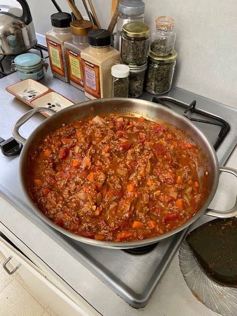
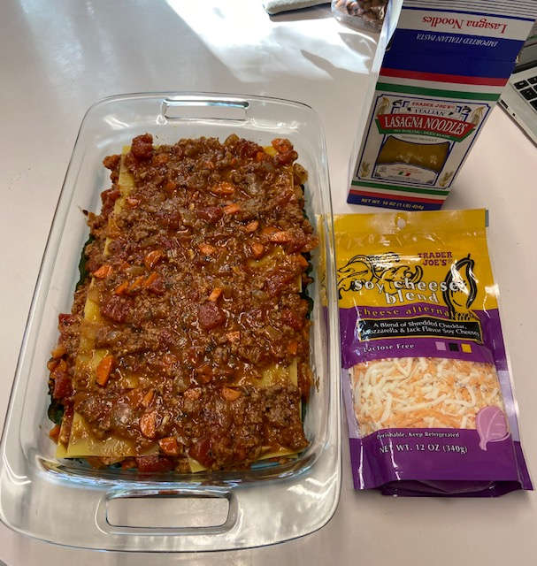
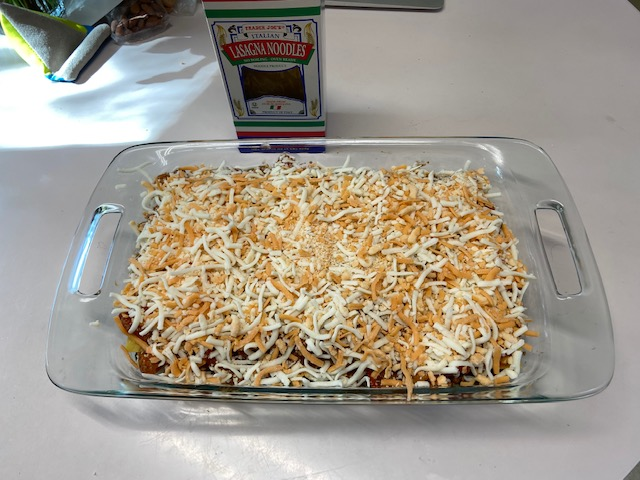
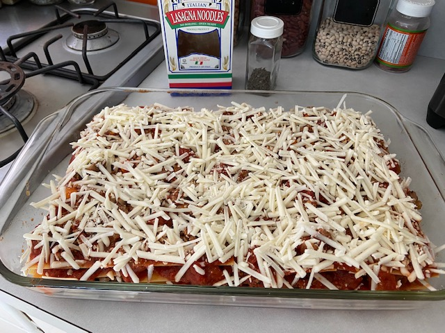
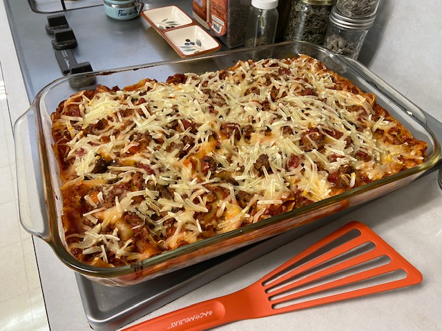
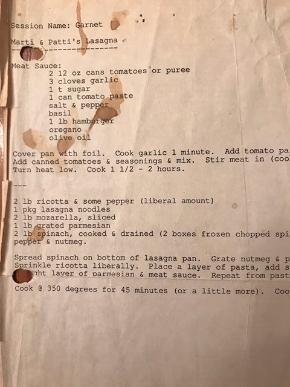

I made a [Vegan Lasagna with Nooch Cheese](https://www.elephantasticvegan.com/lasagne-w-nooch-cheese/) a couple of weeks ago, and it was good, but didn't remind me much of classic lasagna, and Larry didn't like the nooch. So I made a mental note to try to make a classic lasagna with impossible beef and shredded vegan cheese. Two weeks later, my grad school friend Judy texts me: "Hey, there. Happy new year! Happy new administration! Just going through my old recipe binder and found (this)" -- a recipe for lasagna that I gave her back around 1990. Yay, I get to veganize my own recipe. Thank you, Judy! After a few tries, we decided the following was the ticket: biggest pan, less cheese, lots of noodles, a little extra marinara to help the noodles cook.

## Ingredients
### Sauce

- 2 T canola oil
- 3/4 lb (1 pkg) Impossible Beef
- 1 onion, diced
- 2 carrots, diced
- 8 oz mushrooms (optional but recommended)
- 3-4 cloves garlic, diced
- 1/2 tsp red pepper flakes
- 1 tsp smoked paprika
- 3 14 oz cans diced tomatoes
- 2 tsp dried oregano
- 1 tsp dried baslil
- 1/2 tsp salt (or to taste)

### For Layering

- Fresh greens (spinach, kale, broccoli, or other leaf)
- 1 tsp nutmeg
- 1/2 tsp brown pepper
- 1/2 jar marinara (optional, but extra sauce helps the noodles cook, especially for larger pan)
- 10-12 pieces of TJ's lasagna noodles (no pre-cook!)
- 10-12 oz TJs soy cheese blend (cheddar, mozzarella, jack) or other shredded vegan cheese

## Instructions

In a large pan or soup pot, saute onion, carrot, pepper flakes, and salt in oil for a few minutes. Add garlic and paprika (and mushrooms if using), and stir another minute. Add crumbled impossible burger and saute until it turns brown.

Finally, add tomatoes, oregano, and basil, and simmer for 30 minutes. Turn off and let cool. If you want to finish the lasagna tomorrow, put it in a big bowl and refrigerate overnight.

Preheat oven to 350 degrees.

Spread the greens on the bottom of a large baking pan, and sprinkle with nutmeg and pepper. (The original recipe said to blanch or boil first, but I've found that unnecessary, and of course less work is better.)

Make 3 layers of sauce & noodles:

Put a layer of sauce in the baking dish, then a layer of lasagne noodles, then the sauce again, repeat until the baking dish is full, with last layer of sauce on top. (Note: I started spooning on extra sauce from an additional half a jar of marinara as I went to give the noodles even more sauce to cook in, and liked the result.)

After the last layer of sauce, sprinkle the cheese on top. Not too much cheese (and we may try without cheese sometime).

Bake the lasagna in the oven for about 45 minutes, until the cheese sauce is golden brown.

Making the layers:

Medium pan (was too much cheese for us):

Large pan with vegan mozzarella (better, but will try even less cheese next time):

Cooked!

Below is the original that Judy sent me. Marti was my first roommate in grad school, and Garnet was a unix server we had our email accounts on :)

Can you believe how much cheese we used? FIVE POUNDS total. And what's with "cover the pan with foil" before you do anything? That's just weird.

