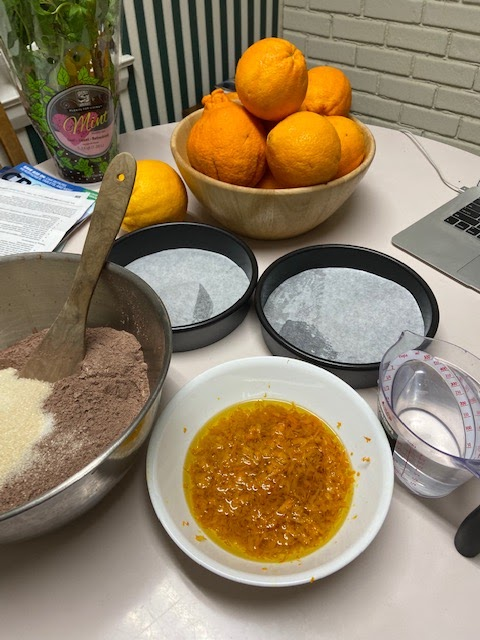
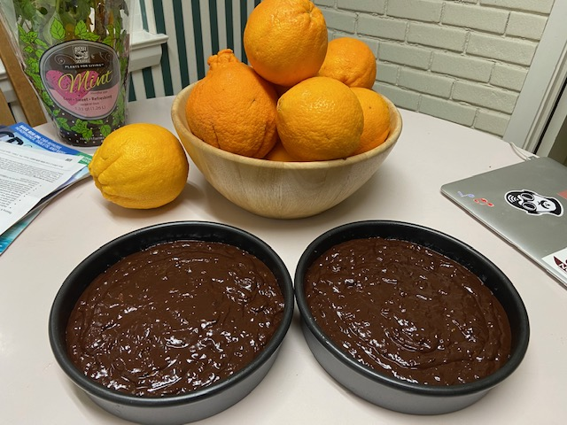
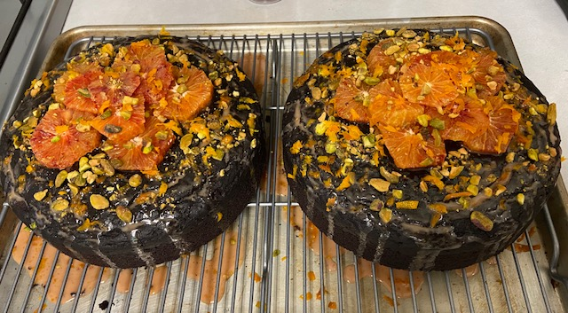
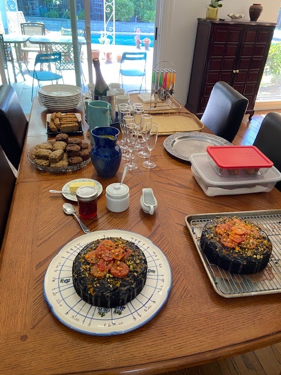
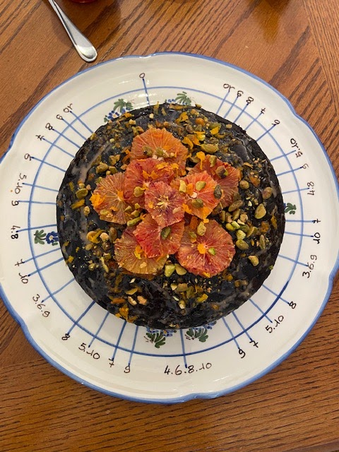

Shelley Million gave us a [blood orange cake](https://tasty.co/recipe/blood-orange-chocolate-olive-oil-cake) when we made a backyard visit in March, and it was divine! I asked Larry what he wanted for his birthday, and he said this cake. Shelley made it with regular oranges and without the topping, and we had lots of oranges on our tree, so I did the same - except I made the topping and used a few blood oranges there, figuring I'd make it extra pretty for the birthday boy. I also doubled the recipe to make 2 rounds since we had 2 birthday parties, but 1 round is plenty for one group. (Also, our tree's oranges are HUGE, and blood oranges at the store were much smaller, so I used fewer oranges; adjust depending on your orange size.)

## Ingredients

- (Makes one tall round; double for 2 rounds)
- zest from 2 oranges
- 1/2 C orange juice (from the 2 oranges)
- 1/2 cup olive oil, plus more for greasing
- 1 1/2 cups flour
- 2/3 cup dark cocoa powder, unsweetened
- 1 1/2 tsp baking soda
- 1/2 tsp salt
- 1 1/4 C sugar
- 1 C water
- 1 1/2 tsp white vinegar

### Topping

- 1 C powdered sugar
- 1-2 small oranges, sliced thin (use blood oranges for red color; regular orange also fine)
- zest from 1 orange
- 3 T orange juice (from the orange)
- 1/4 cup pistachio, raw, roughly chopped (can crush slightly in mortar and pestle)

## Instructions

Zest 2 oranges into a medium bowl. Add olive oil and set aside for 30-60 minutes to infuse.

Juice the 2 oranges to get about 1/2 cup of juice.

Preheat the oven to 350˚F.

In a large bowl, sift together the flour, cocoa powder, baking soda, and salt.

Add the sugar, the orange olive oil (with the zest), the 1/2 cup of orange juice, water, and white vinegar. Whisk until the batter is smooth with no lumps.

Lightly grease the bottom and sides of an 8-9-inch round cake pan with olive oil, and place a parchment round in the bottom of the pan.

Pour the batter into the prepared pan and bake for 35-40 minutes, until a toothpick inserted in the center of the cake comes out clean.

While the cake bakes, prepare the topping:

Sift the powdered sugar into a medium bowl. Zest the 3rd orange into the bowl. Juice the orange to get 3T of juice and add to the bowl. Whisk into a glaze.

Zest the 4th orange and set aside to sprinkle on top of cake at the end. Slice the orange into 1/4 inch wide rounds and carefully remove the skin and pith until you are left with just the flesh.  Place the rounds between 2 paper towels to blot some of the excess juice. This will allow them to stick to the glaze more effectively.

Remove the cake from the oven. Let cool in the pan for 10 minutes, then flip onto a wire rack set over a baking sheet to cool completely.

Once the cake has cooled, pour the glaze over the cake, letting it drip down the sides. Decorate the top with the orange slices, pistachios, and remaining orange zest.

Making the cake (double recipe):

[.jpg)](IMG_5711%20(480x640).jpg)

[.jpg)](IMG_5708%20(640x480).jpg)

[.jpg)](IMG_5716%20(480x640).jpg)
