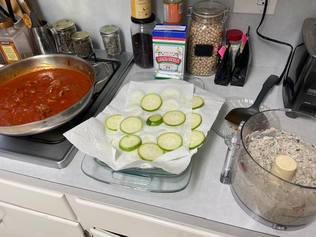
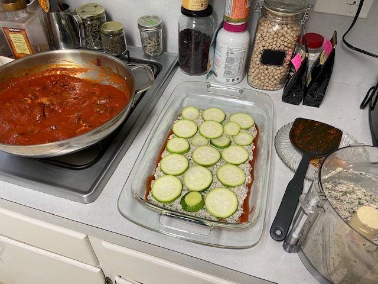
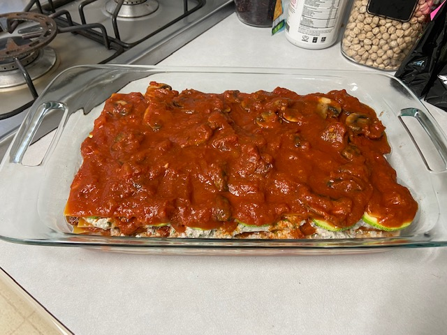
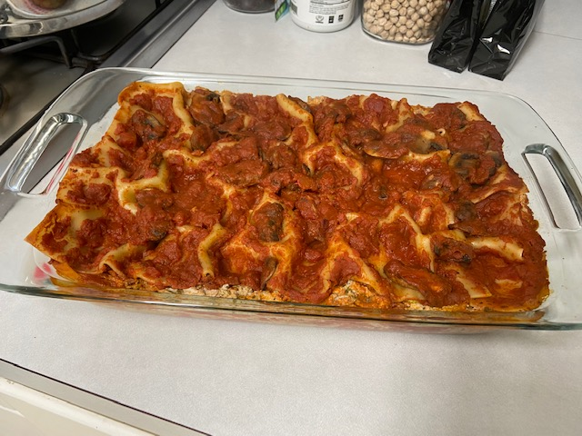

The [Impossible Lasagna](https://peachykeengreen.blogspot.com/2021/01/impossible-lasagna.html) that I blogged earlier this year is tasty, but Impossible beef has a heavy taste like real beef does. We wanted to try a lighter, no-fake-meat lasagna, and I found the perfect recipe in my [Chloe's Kitchen](https://www.chefchloe.com/)cookbook. Looks like [Happy Healthy](https://www.happyhealthylonglife.com/happy_healthy_long_life/2013/02/enlightened-lasagna.html) did the same. Here's my slightly-adapted version of Chloe's great recipe. It's super easy and delish!

## Ingredients

- 50 oz marinara (I like Rao's)
- 9 oz box no-boil lasagna noodles

### Veggies

- 5 oz spinach
- 10 oz mushrooms, sliced
- zucchini, sliced (optional)

### Garden Ricotta

- 1 medium onion, chopped
- 3 cloves garlic, chopped
- 14-ounce firm tofu
- 2 T of lemon juice
- 1/2 tsp of salt
- 1 1/2 tsp freshly ground black pepper
- 3 C of fresh basil
- 1 T white miso (optional; I don't always have it)

## Instructions

Preheat oven to 375 degrees.

Make the ricotta: Saute onion 5-7 minutes until soft.  Let cool. In a food processor, combine onions, garlic, drained tofu, lemon juice, salt, pepper, & miso paste if using.  Pulse until the mixture is almost smooth, but still has some texture.  Add basil and pulse a few more times to mix it in, but leave chunks.

Assemble the lasagna:

- Spread a thin layer of sauce on the bottom of your pan.

- Arrange 4 lasagna noodles across the pan.  Spread half of the Garden Ricotta over the noodles.  Layer half of the spinach and mushrooms (and zucchini, if using) over the Garden Ricotta.

- Arrange 4 more noodles on top of the spinach layer.  Spread another layer of sauce over the noodles, and then arrange 4 more noodles on top--and then top the noodles with another layer of sauce.  Yep, that's the weird part.  Noodles, sauce, noodles, sauce.

- Finally, spread the remaining Garden Ricotta on top of the sauce layer.  Top the Ricotta with the remaining raw spinach and mushrooms (and zucchini, if using).  Now finish with final layer of 4 noodles--and top the noodles with the remaining sauce.

Cover the lasagna pan with foil and bake at 375 degrees for about 45 minutes or until the noodles are cooked and the sauce is hot & bubbly.  Remove from the oven & let it sit for about 10 minutes before serving.

Assembly:

Interesting texture once cooked:

