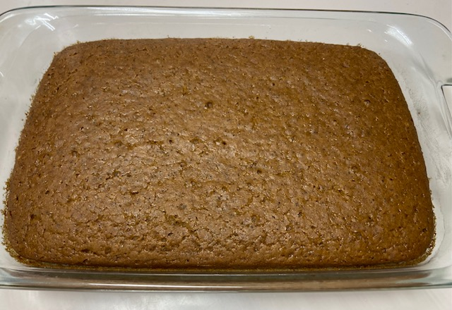

For our acappella rehearsal, Harold's wife Chris served this delicious, easy spice cake without frosting. The recipe came from her kids elementary class, made vegan so more kids could eat it. It's delish without any frosting, and I've made it as muffins, too. For a special occasion, add pumpkin to the mix and top with a cream cheese frosting.

## Ingredients

- Dry:
- 3 C flour
- 2 C brown sugar
- 2 tsp baking soda
- 2 tsp baking powder
- 1 tsp salt
- spices:
- 2 tsp cinnamon
- 1/2 tsp allspice
- 1 tsp ginger
- 1 tsp cloves
- Wet:
- 1/2 C oil
- 2 T vinegar
- 2 tsp vanilla
- 2 C warm water OR (optional) 1 can pumpkin and ~1 C water for pumpkin spice cake version
- Cream cheese frosting (optional):
- 6 oz Miyoko's plant-based cream cheese
- 4 oz Miyoko's vegan butter
- 1 tsp vanilla
- 2 C powdered sugar (more or less, to desired thickness)
- Chocolate version: Use white sugar instead of brown and 1/2 C cocoa in place of spices; everything else the same!

## Instructions

Mix dry ingredients together in a large bowl. Mix together wet ingredients, then pour over dry. Mix until all dry ingredients are moistened. Do not over mix.

Bake in a greased 9x13" pan for 30-35 minutes in a 350 degree oven. If making pumpkin spice cake with cream cheese frosting, I bake in 2 rounds plus half a dozen or so cupcakes.

If using frosting, make frosting while the cake is baking.

Remove cake and let cool. Eat as is, or optionally frost.

Without frosting:

