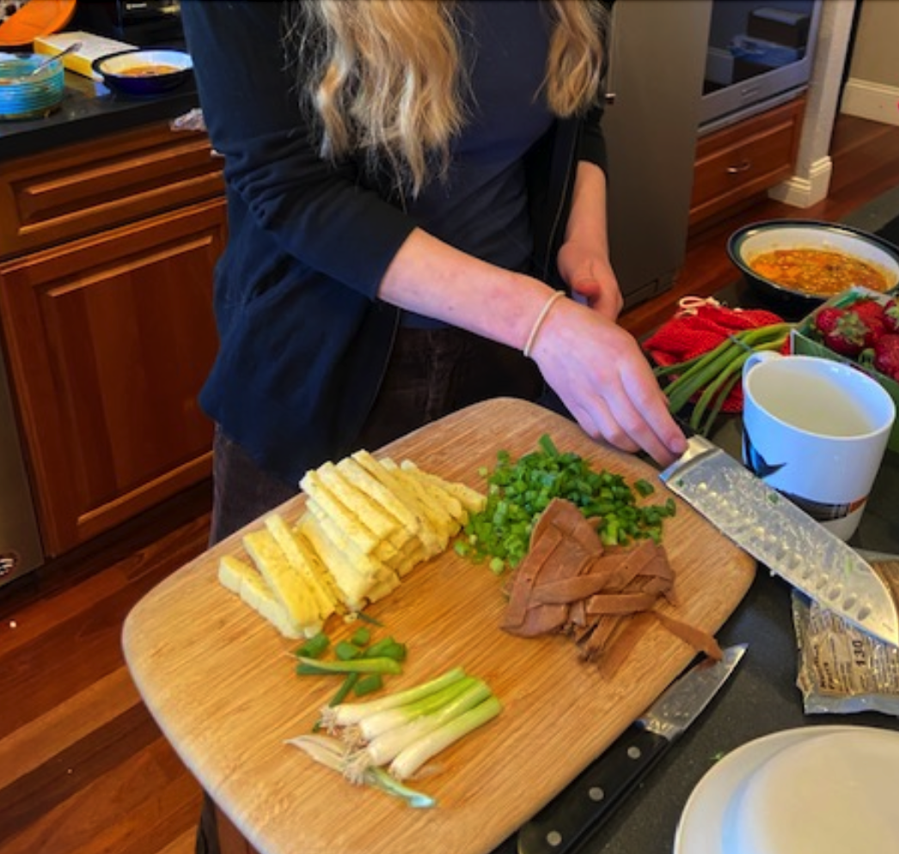
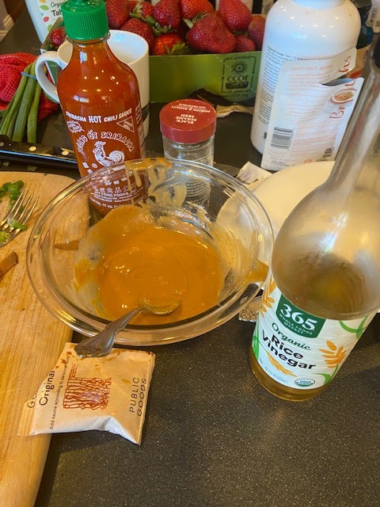
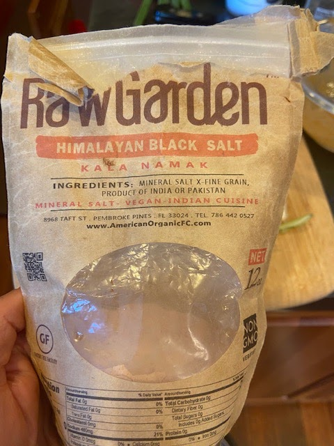
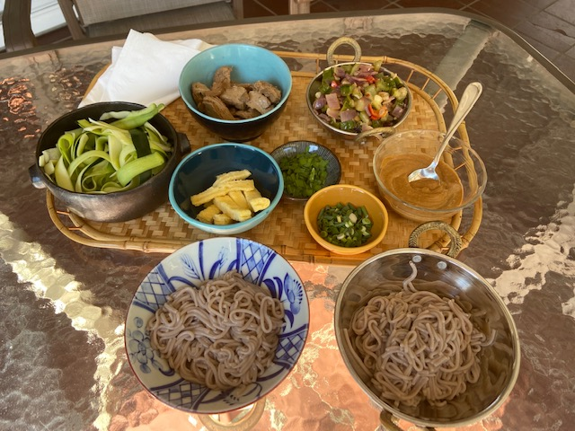
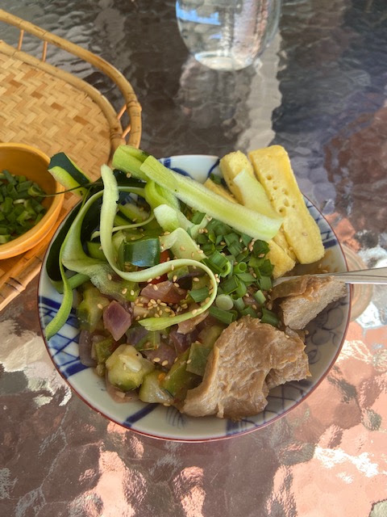

We had a super fun, impromptu potluck today at Judi and Nick's, featuring soba noodles with Kira's special sauce. So delicious! The amounts below are guesses based on watching Kira mix; no measurements were made. Kira says measure with your heart. Aaaw!

p.s.
A week after posting Kira's recipe, I got the ingredients for this tahini-sauce based soba: [Panko-Crusted Tempeh with Lemon Zucchini Soba & Avocado](https://www.purplecarrot.com/plant-based-recipes/panko-crusted-tempeh-with-lemon-zucchini-soba-avocado) from Purple Carrot. The best part was the zucchini ribbons! Just take off slices with a peeler, toss with a little lemon, and toss on the plate. Easy and yummy. But Kira's overall recipe is better and easier. I'll just toss zucchini ribbons on it next time.

## Ingredients
### Sauce

- 2 T tahini
- 1 T white miso
- 2 tsp sriracha
- 2 tsp soy sauce
- 2 tsp rice vinegar
- 1/2 tsp powdered ginger
- 1/2 tsp powdered garlic
- 2 t rice vinegar

### Toppings

- 2-4 Just Egg folded patties
- 2 Sweet Earth Applewood Smoked Plant-based Ham deli slices
- 2 diced scallions
- (optional) 1 zucchini, sliced into ribbons
- 1 package buckwheat soba noodles
- Black sesame seed
- (optional) Himalayan black salt (lightly sprinkle on just egg for more sulfur egg flavor)
- 1-2 T canola oil
- 2-3 C broccoli, chopped (oops, took photo before I added this to the dish!)
- 1 small red onion

## Instructions

Saute onion and chopped broccoli in oil.

Slice the just egg and deli slices into strips, and dice the scallions.

Boil the soba noodles as directed on the package and rinse with cool water.

Whip together the sauce ingredients.

Put noodles in a bowl, drizzle with sauce, add toppings, and sprinkle with black sesame seeds. Eat. Yum!

Slicing the just egg, scallions, and plant-based ham:

Mixing up the sauce!

Purple Carrot version with panko-crusted tempeh:

Optional black salt with egg-like sulfur flavor (noting this for future fake egg dishes; could use in vegan quiche?)

Version that I made months later, with veggie duck!

