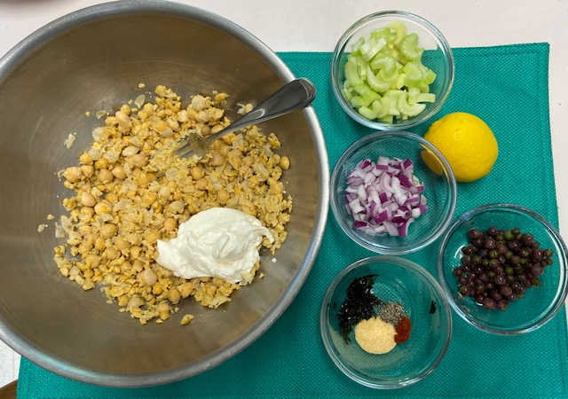
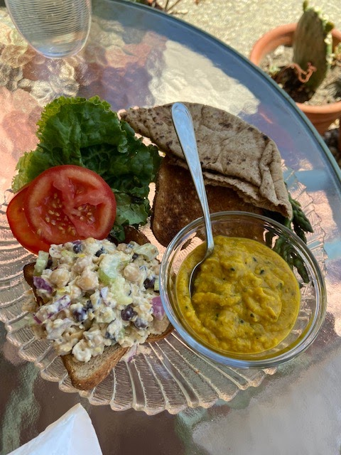
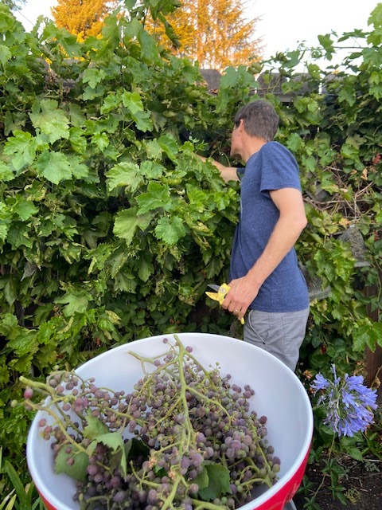

Our grape vines are prolific, but the grapes are teeeeeeny. Larry's sister Cyndy mentioned that she loved putting grapes in any sandwich, like tuna or turkey. That reminded me of a nice "fake tuna" salad I made long ago. So I did a quick search and adapted [this recipe](https://simple-veganista.com/chickpea-of-sea-salad-sandwic/) by adding grapes. Really good! I might add pickles next time - or at least serve them on the side.

## Ingredients

- 1 can (14 oz) garbanzo beans, drained and rinsed
- Zest of 1 lemon
- Juice of 1/2 lemon
- 1/3 C vegan mayo
- 1/3 C celery, chopped
- 1/4 C red onion, chopped
- 1/2 tsp garlic powder
- 1/2 tsp pepper
- 1/4 tsp cayenne or chili powder
- optional:
- 2 crushed or shopped nori sheets (seaweed)
- 1 T chia seeds or hemp hearts (for some omega 3)
- 1/3 C grapes
- 1/4 C chopped dill pickle (or dill relish)

## Instructions

Mash chickpeas: Drain and rinse chickpeas, place in medium size bowl and roughly mash about 3/4 of the chickpeas with the back of a fork or potato masher, until desired consistency.

Assemble salad: Add the rest of the ingredients and mix well, adding any extra ingredients you like.

Serve on toasted bread with sliced tomato and leafy greens, or on lettuce like a wrap or salad, or with fresh scoopable veggies (like cucumber, red bell peppers), or with crackers. Yum!

