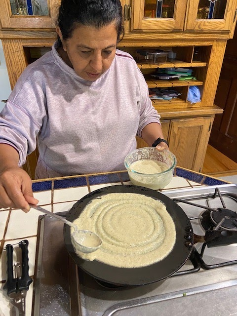
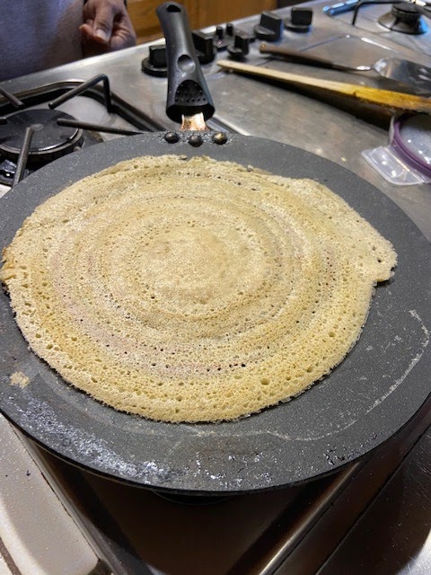
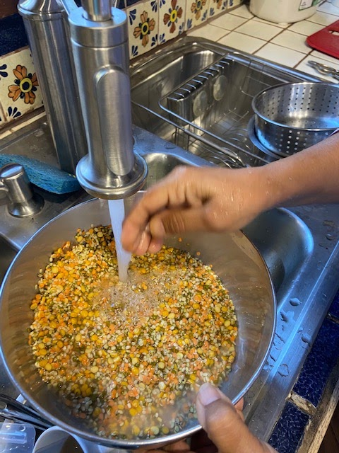
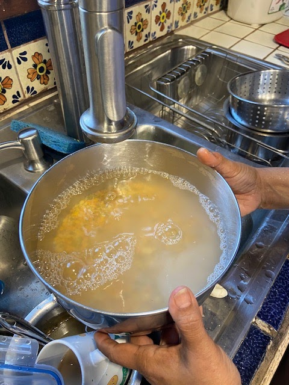

Munira is visiting from Texas, yay! We biked over with some [fig banana bread](https://peachykeengreen.blogspot.com/2022/09/fig-banana-bread.html), and she treated us to an impromptu, delicious dinner of her lentil dosa and [secret gobi](https://peachykeengreen.blogspot.com/2021/11/muniras-secret-gobi.html). I thought dosa was super hard to make, but she showed me how -- and it wasn't so hard! I'm very excited because besides their delicate deliciousness, her lentil dosas are high protein, super healthy, and a wonderful pairing with indian veggies. She also cooked up some bhindi masala for her IT guy (Larry) and sent it home with us, along with leftover dosa batter and a (loaner) dosa pan so I could practice my dosa-making skills again tomorrow.  Sweet! She recommended serving with lettuce, tomato, and chopped onion, and filling the center and rolling up into a "stuffed" wrap. Lots of possibilities!

Rough measurements for ingredients follow (of course no actual measuring was done :)

## Ingredients

- 1/2 C red lentils
- 1/2 C green lentils
- 2/3 C urad dal
- 2/3 C channa dal
- 1 tsp salt (or to taste)
- Water (for rinsing & soaking)

## Instructions

Measure out the lentils into a bowl together and mix. Rinse well a couple of times, then add several cups of water and soak overnight. The next day, grind up the soaked lentils in a blender. Add a little salt, and water as needed, to make a thin batter.

Warm a crepe pan on medium heat. Pour about 1/2 C of the batter on the center of the pan and spread it out in a slow, circular fashion. Cook a few minutes, until the edges start to pull away from the pan. Use a flat spatula/knife to carefully lift the dosa starting at the edges until it's completely free, and then flip it. Cook a few more minutes. Serve warm and eat immediately. Yum!

Making the batter: Rinse and soak!

