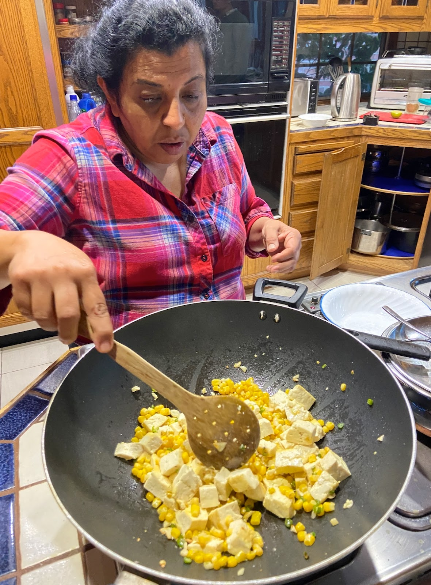

A simple, delicious dish, created by Munira. Who'da thought corn and tofu would be so good together? You might be tempted to add other ingredients; feel free. Bell peppers, for example, are delish in the mix. But it really is delicious in its simplicity.

## Ingredients

- 1 block tofu, drained
- 2 cups frozen corn, thawed
- garlic, diced
- pepper, diced
- oil
- salt to taste
- optional: bell peppers (chopped)

## Instructions

Press the tofu to drain some of the water. Cut into chunks.

In a pan, saute diced garlic and pepper in oil. Add the tofu and saute until browned. Add the corn and saute a few more minutes. Salt to taste. Serve with rice or roti.

