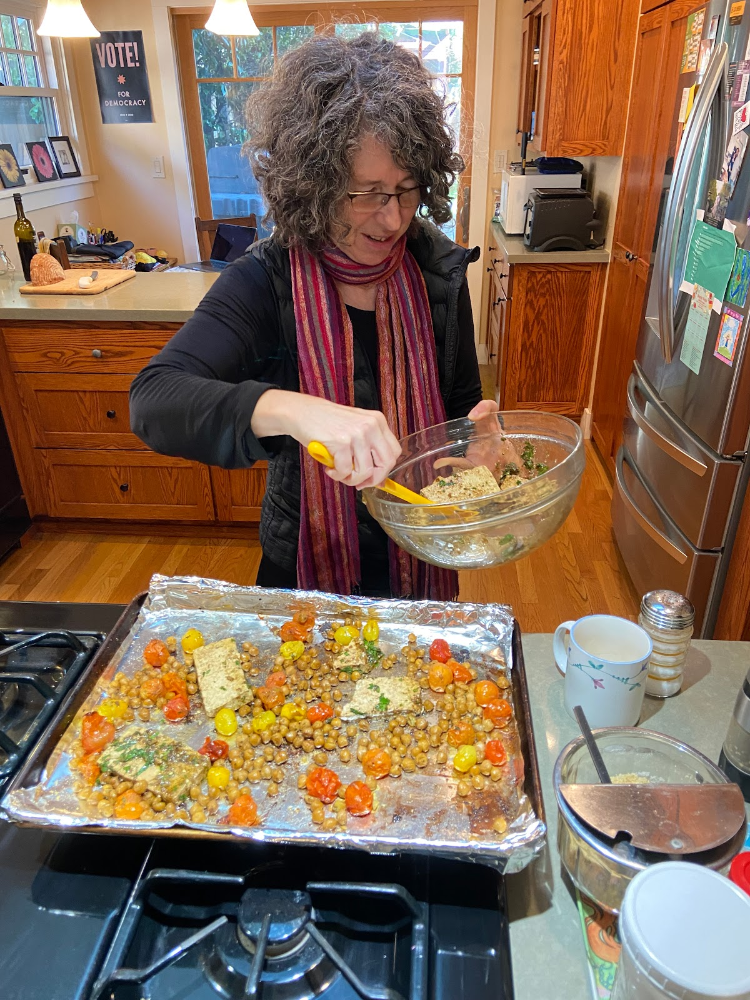
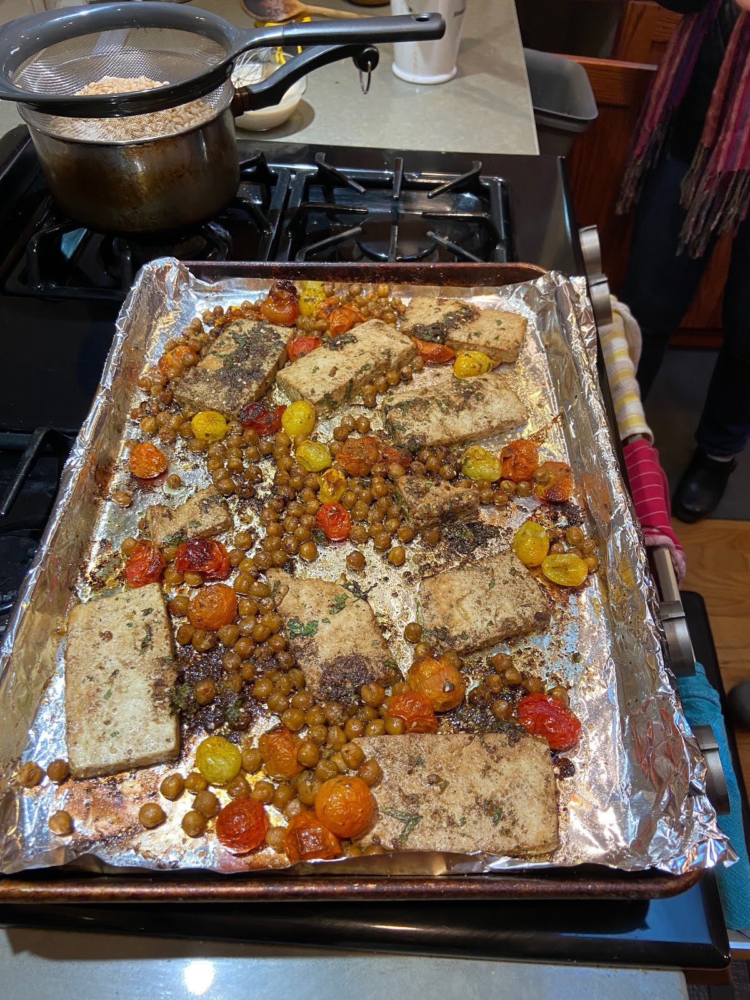
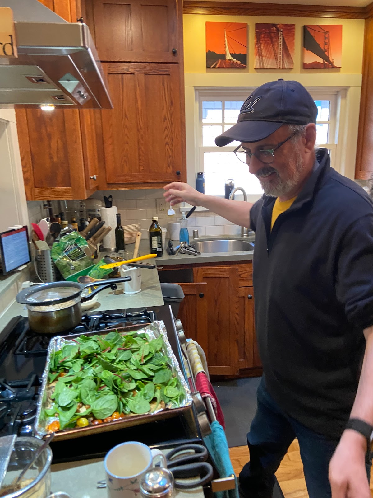
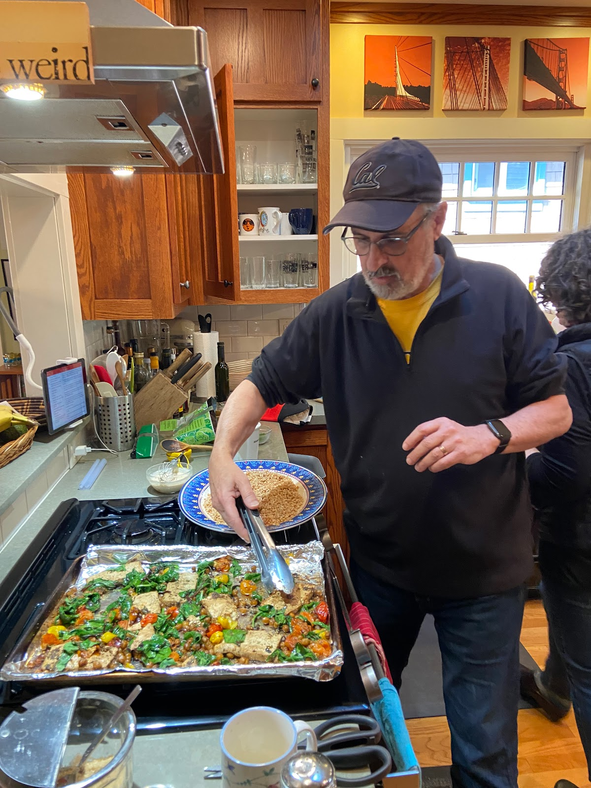
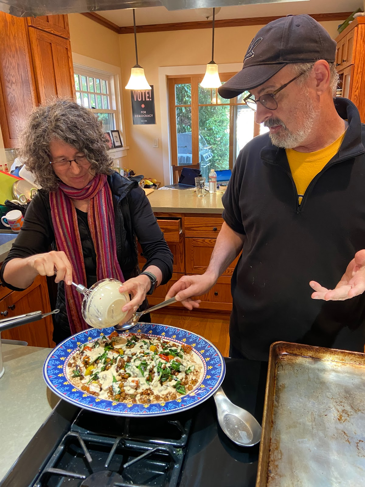

Judy and Robert made a variation of this delicious NYTimes recipe for [Za’atar Roasted Tofu With Chickpeas, Tomatoes and Lemony Tahini](https://cooking.nytimes.com/recipes/1023630-zaatar-roasted-tofu-with-chickpeas-tomatoes-and-lemony-tahini) for lunch before we enjoyed a beautiful hike through redwoods at [Robert's Regional Recreation Area](https://www.ebparks.org/parks/roberts). Below is a variation close to what they made, and I want to replicate!

## Ingredients

- 14 oz firm tofu, drained1 can chickpeas, drained, rinsed and patted dry
- 1 pint cherry or grape tomatoes (can also try butternut squash)
- 1 (8-ounce) bag leafy greens, such as baby spinach, baby kale, arugula, or mixed greens
- Salt and pepper
- Marinade:
- 3 garlic cloves, diced
- 2 lemons
- 2T oil
- 1 1/2 T za’atar dry spice mix
- 1 tsp dried oregano or marjoram
- 1/2 cup chopped flat-leaf parsley
- 2 T soy sauce (for 2nd half of marinade, used on tofu)
- Dressing:
- 1/4 C tahini
- 1 T honey
- 2T water
- Farro, barley, wild rice medley, or other grain, for serving

## Instructions

Heat oven to 425 degrees. Cut the drained tofu into 1/2-inch-thick slices. Combine the chickpeas and tomatoes on a half-sheet pan and sprinkle with salt and black pepper to season.

Zest 1 lemon into a large bowl. Add garlic and 1/4 C juice from the lemons. Add the oil, za’atar, oregano and ¼ cup chopped parsley to the garlic mixture and stir to combine. Pour half of the marinade over the chickpeas and tomatoes, toss to combine and spread in an even layer. Roast until the tomatoes are just beginning to burst open and the chickpeas are warmed through, about 15 minutes.

Meanwhile, add the soy sauce to the remaining marinade and stir. Add the tofu slices to the bowl and carefully turn each piece to coat both sides. Allow the tofu to marinate while the chickpea mixture cooks. Then nestle the tofu slices, topped with any leftover marinade in the bowl, among the chickpeas and tomatoes on the sheet pan.

Roast until the tofu begins to brown around the edges and top, the tomatoes have burst open releasing their juices and the chickpeas are golden brown and crunchy, about 15 minutes.

While the tofu roasts, whisk together the tahini, honey, reserved lemon juice and 2 tablespoons of water. Season to taste with salt and black pepper.

Turn off oven. Remove sheet pan from oven and top with greens.  Put pan back in turned-off oven, still hot enough to wilt the greens, then mix them in.

Spread farro (or other grain) on a large plate. Carefully transfer the roasted mixture onto the farro. Dress the plate with tahini mixture and sprinkle with remaining ¼ cup parsley. Serve!

