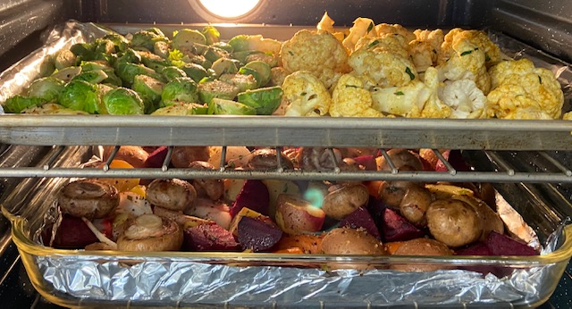

So many vegetables work here; I go for a nice mix of color. I almost always use root vegetables like potatoes, carrots, onions, and beets, sometimes bell pepper, and often mushrooms or other vegetables (like asparagus) that need less cooking. Using [silicon baking liners](http://www.amazon.com/Silicone-Baking-Liners-3-Pack-Colors/dp/B002J4BARM) makes cleanup super easy. Pictured is a colorful tray that I took to Elsa & John's 2026 fourth of July party.

## Ingredients

- A mix of vegetables, like:
- potatoes
- beets
- yams
- carrots (with part of tops!)
- onions
- brussel sprouts
- cauliflower
- red pepper
- mushrooms
- Optionally, some fast-cooking vegetables like:
- green beans
- asparagus
- Seasoning:
- 1/4 C canola oil
- 1 tsp sea salt
- 1 tsp pepper
- Juice from 1/2 of a lemon
- 2-3 cloves garlic, diced
- 1 tsp TJs 21 spice blend
- Herbs like oregano, rosemary, basil

## Instructions

Clean the veggies and cut off any blemished ends, etc. I don't bother skinning anything but yams. Cut carrots diagonally; cut others into halves or fourths, or whatever size you prefer (not too small, not too big :)

While the veggies are drying, preheat the oven to 400 degrees, and put silicon liners in a cookie sheet that has edges on all 4 sides.

Toss veggies into a bread bag or ziploc. Add oil and seasoning. Shake shake shake. Shake shake shake. Shake your veggies. Shake your veggies.

Pour the veggies into the pan. Repeat if you didn't get all the veggies into the first bag. Admire all the pretty colors in the baking pan/sheet. Optionally sprinkle more seasoning on top of the veggies.

Set the timer for 50 minutes. If you have some set-aside short-cooking veggies like asparagus, leave them in the baggie, set the timer for 30 minutes, and then add them for the last 20 minutes. Turn off the oven and let them sit awhile, or remove to cool. Try not to burn your tongue when you sneak bites.

