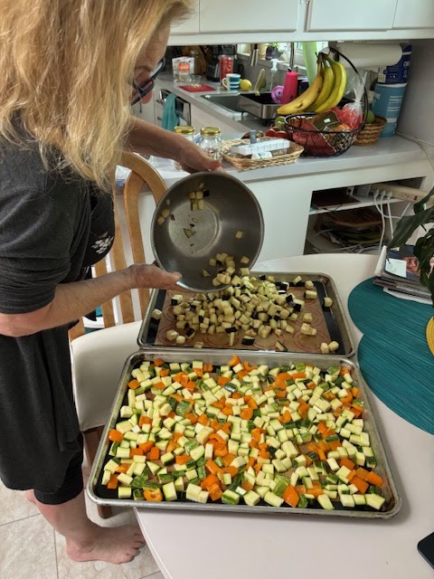
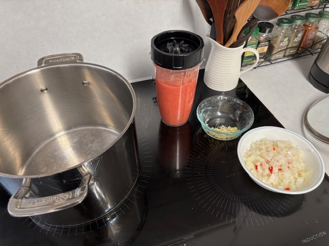
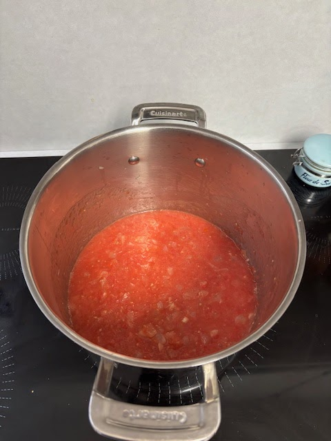
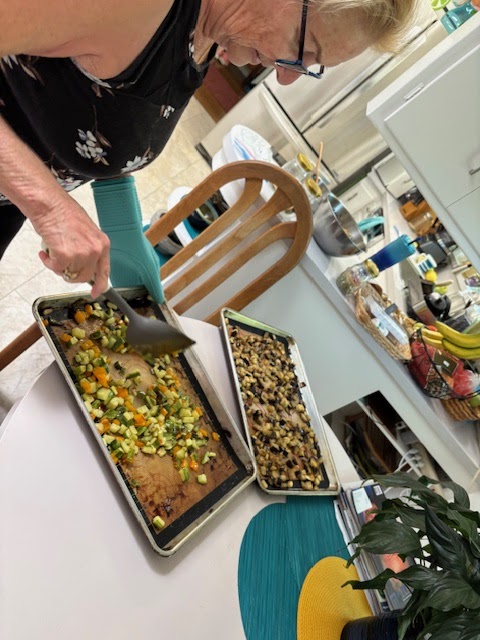

Our kitchen was overflowing with zucchini and tomatoes from our and Elsa's garden. Larry fondly recalled ratatouille, so Cyndy and I gave it a try during her visit. We decided on this roasted vegetable version. Really good! And the fresh tomatoes added a lot.

Update: I've also just tossed the zucchini, pepper, eggplant together in salt and oil and air-fried for about 15 minutes (stir halfway), and then tossed it into the sauce. It might take two air fry batches. Still, it's easier and delish.

## Ingredients

- 1 eggplant, diced into ½-inch cubes
- 1 bell pepper, cut into ¾-inch squares
- 2 zucchini (green, or mix of green and yellow), diced into ½-inch cubes
- 2 pounds ripe red tomatoes (6 medium or 4 large)
- 1 small onion, diced
- 4 cloves garlic, minced
- 1/4 C chopped basil
- 1/4 T red pepper flakes (or dice a hot pepper)
- olive oil
- salt
- fresh pepper

## Instructions

Preheat the oven to 425 degrees.

Line two large, rimmed baking sheets with silicon sheets or parchment paper.

Chop tomatoes and puree in a blender/food processor.

Dice eggplant, zucchini/squash, and pepper.

On one baking sheet, toss the diced eggplant with 2 tablespoons of the olive oil until lightly coated. Arrange the eggplant in a single layer across the pan, sprinkle with ¼ teaspoon of the salt, and set aside.

On the other baking sheet, toss the bell pepper, and zucchini squash with 1 tablespoon of olive oil and ¼ teaspoon salt. Arrange the vegetables in a single layer.

Place the eggplant pan on the middle rack and the other vegetables on the top rack. Set the timer for 15 minutes.

 Meanwhile, saute onion, ¼ teaspoon salt, and hot pepper. Cook, stirring occasionally, until the onion is tender and caramelizing on the edges, about 8 to 10 minutes.

Add the garlic, stir, and cook until fragrant, about 30 seconds. Add the tomatoes, stir. Reduce the heat to medium-low, or as necessary to maintain a gentle simmer.

Once 15 minutes are up, remove both pans from the oven, stir, and redistribute the contents of each evenly across the pans. This time, place the eggplant on the top rack and other vegetables on the middle rack.

Bake until the eggplant is nice and golden on the edges, about 10 more minutes (the eggplant will be done sooner than the rest). Remove the eggplant from the oven, and carefully stir the eggplant into the simmering tomato sauce.

Let the squash and bell pepper pan continue to bake until the peppers are caramelized, about 5 to 10 more minutes. Then, transfer the contents of the pan into the simmering sauce. Continue simmering for 5 more minutes to give the flavors time to meld.

Remove the pot from the heat. Stir in 1 teaspoon olive oil and fresh basil. Season with black pepper.

Serve in bowls, perhaps with a little drizzle of olive oil, additional chopped basil, or black pepper on top.

