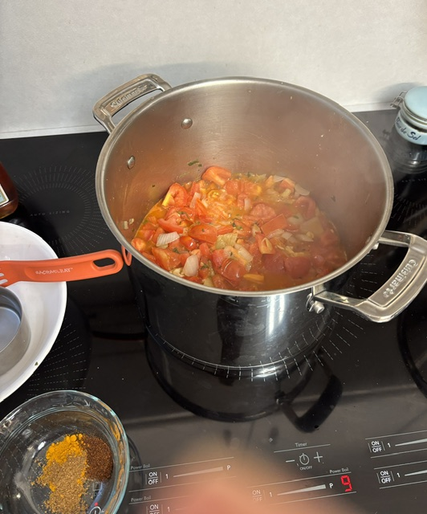

Nick and I love Darbar's Shahi Paneer, so I wanted to try making a vegan version. After some experimentation, this worked well, somewhat like [Vegan Richa's Butter Tofu](https://www.veganricha.com/butter-tofu-paneer-tofu-butter-masala-recipe/) recipe.

## Ingredients

- 1 T canola oil
- 1 inch ginger, diced
- 1 small hot chili, chopped
- 1 medium red onion, chopped
- 1 tsp fenugreek seeds (or green methi)
- 1 tsp salt
- 6 medium tomatoes, chopped
- 4 cloves garlic, chopped
- 2 T vegan butter
- 1/2 C cashews, soaked in 1 C and blended, OR
- 1/2 C coconut milk
- 1 tsp turmeric
- 1 tsp garam masala
- 1 tsp chili
- Tofu, pressed, drained and cut up
- Tofu marinade of your choice, or try:
- 2 tsp minced garlic
- 1/2 tsp garm masala
- 2 tsp lemon juice
- 2 T water
- 2 T cornstarch or potato starch
- 1 tsp nutritional yeast
- 1 T canola oil
## Instructions

Press, drain, and cut up the tofu. Marinate as desired, and air-fry or bake.

Saute ginger, chili, onion, fenugreek seeds, and salt in oil. Add tomatoes, garlic, and butter and cook a few minutes. Add blended cashews or coconut milk (or both!). Add spices and mix well. Mix and bring to a boil. Add water if needed for preferred consistency. Cool. Puree in blender or with hand mixer.

Fold in baked tofu. Simmer for a minute. Serve with rice or roti.

Dinner!

Making:

